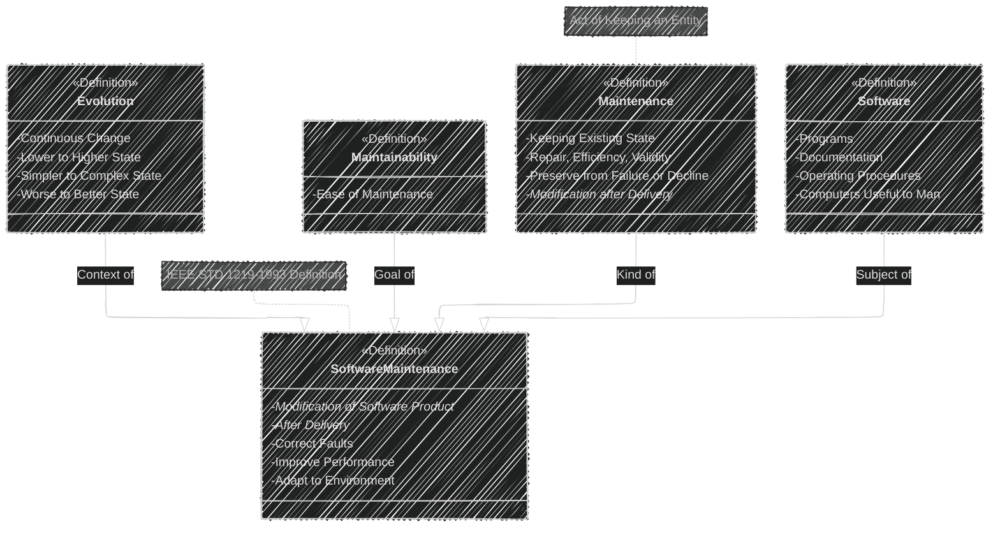
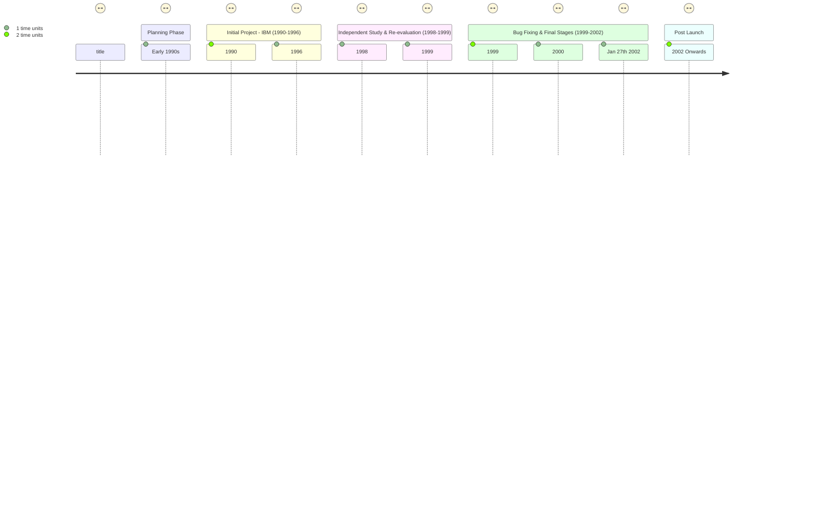

----


# Diagram 1: Overview of the chapter 1 - Introduction to Basic Concepts


```mermaid
---
config:
  layout: elk
  look: handDrawn
  theme: dark
---
mindmap
  root((Chapter 1: Introduction to Basic Concepts))
    node(1.1 Introduction)
      label(Software Maintenance defined)
      label(Discipline after delivery)
      label(High Costs: 40-70% lifecycle)
      label(Urgent need for solutions)
      label(Proliferation of Software Systems)
      label(Importance of System Usefulness)
      label(Life & Death Context)
      label(Challenges of Change Management)
    node(1.2 Definitions)
      node(Evolution)
        label(Continuous change)
        label(Simpler to Complex)
        label(Worse to Better)
      node(Maintainability)
        label(Ease of Maintenance)
      node(Maintenance)
        label(Keeping Existing State)
        label(Repair, Efficiency, Validity)
        label(Preserve from Failure/Decline)
      node(Software)
        label(Programs)
        label(Documentation)
        label(Operating Procedures)
        label(Computers Useful to Man)
      node(Software Maintenance)
        label(Modification after Delivery)
        label(Correct Faults)
        label(Improve Performance)
        label(Adapt to Modified Environment)
    node(1.3 The Basics of "Software")
      label(Software != Programs alone)
      label(Comprehensive View)
        label(Programs: Source & Object Code)
        label(Documentation: Analysis, Design, User Manuals)
        label(Operating Procedures: Setup, Failure Response)
      node(Maintainability - Difficult to Quantify)
        label(Complexity Measures Exist)
        label(Interoperability, Standards are factors)
        label(No Simple 'Maintainability Factor')
        label(Recognizing Maintainability Traits is Key Skill)
        label(Maintainer Worth = Weight in Gold)
        label(Maintainers becoming "Elite")
    node(1.4 New Development vs Maintenance)
      label(Maintenance - Constraints of Existing System)
      label(New Development - Green Field Site)
      label(Impact Analysis - Before ANY work)
      node(Difference in Enhancement Design)
        label(Maintenance - Investigate Current System)
          label("Architectural Design")
          label("Low-Level Design")
        label(Designer Needs to:)
          label("Accommodate Change")
          label("Predict Ripple Effect")
          label("Determine Skills Required")
      node(Jones Analogy - Room Addition)
        label("Do not weaken existing structure")
        label("Cost per sq ft higher in maintenance")
        label("Remove walls, reroute circuits, avoid disruption")
    node(1.5 Why Software Maintenance is Needed)
      label(Continuity of Service)
        label("Keep Running")
        label("Life-Threatening Failures Possible")
        label("Daily Life Managed by Computers")
      label(Mandatory Upgrades)
        label("Government Regulations")
        label("Tax Laws Change")
        label("Competitive Edge")
      label(User Requests for Improvements)
        label("Better System = More Use")
        label("Functionality Enhancements")
        label("Performance Improvements")
        label("Customization")
      label(Facilitate Future Maintenance)
        label("Shortcuts Costly Long-Term")
        label("Code & Database Restructuring")
        label("Documentation Updates")
      label("System is Never Finished if Used")
    node(1.6 Maintaining Systems Effectively)
      label(Good Grounding in Theory & Skills Essential)
      label(Key Discipline for System Operation)
      label(Far-Reaching Maintenance Activities)
      label(Wider Skillset needed)
        label("Beyond Programming")
        label("Comprehension Skills")
        label("Analytical Powers")
    node(1.7 Case Study - Air Traffic Control)
      label("UK New System Delays <br> (1990-2002)")
      label(Old System Over Capacity)
      label(Initial Decision - Brand New Bespoke System)
      label(Delays, Bugs, Cost Overruns)
      label(Off-the-shelf components suggested)
      label(Safety Compromised by Delays)
      label(Less Ambitious European Upgrades - More Success)
    node(1.8 Categorizing Software Change)
      label(Motivation for Change)
      label(Understanding When/How to Change)
      label(Resource Assignment)
      label(Prioritizing Change Requests)
      node(Categories of Change)
        label("Modification by Defects")
        label("Environmental Modifications ")
        label("Expanded Requirements")
        label("Prevent Malfunctions")
    node(1.9 Summary)
      label("Maintenance Costs 40-70% Life-cycle")
      label(Understand Basic Terms: Software, Maintenance, Evolution)
      label(Maintenance != Development - Key Differences)
      label(Software Maintenance - Increasing Importance)
      label(Theoretical Base Underpins Maintenance)
      label(Next Chapter: Maintenance Framework)

%% style root fill:#f0f,stroke:#333,stroke-width:1px

```

This mindmap provides a comprehensive overview of Chapter 1, breaking down each section (`1.x`) into its main points. It highlights the definitions, key comparisons (Development vs. Maintenance), reasons for maintenance, and the case study, all within a hierarchical structure typical of a mindmap.


----


# Diagram 2: Definitions




This class diagram visually represents the definitions discussed in section 1.2. It shows the relationships between the terms: Evolution, Maintainability, Maintenance, Software, and Software Maintenance, clarifying how they are interconnected, especially Software Maintenance as a specialized form of Maintenance applied to Software with goals of Maintainability and considered within the context of Evolution. Notes highlight key aspects of the definitions from the text.

---

# Diagram 3: Components of a Software System

```mermaid
---
config:
    themeVariables:
      darkMode: true
---
table Diagram
    title Components of a Software System
    header Component | Examples
    row Program | Source code
    row  | Object code
    row Documentation  | Analysis/Specification (Formal spec, Context diagram, DFDs)
    row   | Design (Flowcharts, ER charts)
    row   | Implementation (Source code listings, Cross-reference)
    row   | Testing (Test data, Test results)
    row Operating Procedures | Instructions to setup and use
    row  | Instructions on how to react to failures
```


This table directly represents Table 1.1 from the textbook, listing the components of a software system (Program, Documentation, Operating Procedures) and providing specific examples for each, making it easy to grasp the concrete elements of "software" beyond just "programs".

---

# Diagram 4: New Development vs. Maintenance

```mermaid
---
config:
    themeVariables:
      darkMode: true
---
table Diagram
    title New Development vs. Maintenance Differences
    header Feature | New Development | Maintenance
    row Site | Green Field | Existing System
    row Constraints | Few | Parameters and Constraints of Existing System
    row Impact Analysis | Environment for new system | Ramifications on existing system
    row Design Focus | Original design, new features | Accommodating change in current architecture
    row Designer Needs | Create new architecture | Abstract existing architecture, accommodate changes
    row Risk | Lower (within scope of new system) | Higher (ripple effect on live system)
    row Cost per sq ft | Lower | Higher (rerouting, removing existing elements)
    row Analogy | Building New Building | Adding Room to Existing Building
```


This table highlights the key differences between New Development and Software Maintenance, based on section 1.4. Features like 'Site', 'Constraints', 'Impact Analysis', 'Design Focus' and 'Cost' are compared directly to emphasize the unique challenges and characteristics of maintenance work compared to new development.

---

# Diagram 5: Case Study - Air Traffic Control Project Timeline




This journey diagram visualizes the Air Traffic Control case study timeline from Section 1.7.  It maps out the key phases of the project, from initial planning to post-launch, highlighting the delays, challenges, and stakeholders involved at each stage, making the chronology of events and the project's struggles very clear.

----
