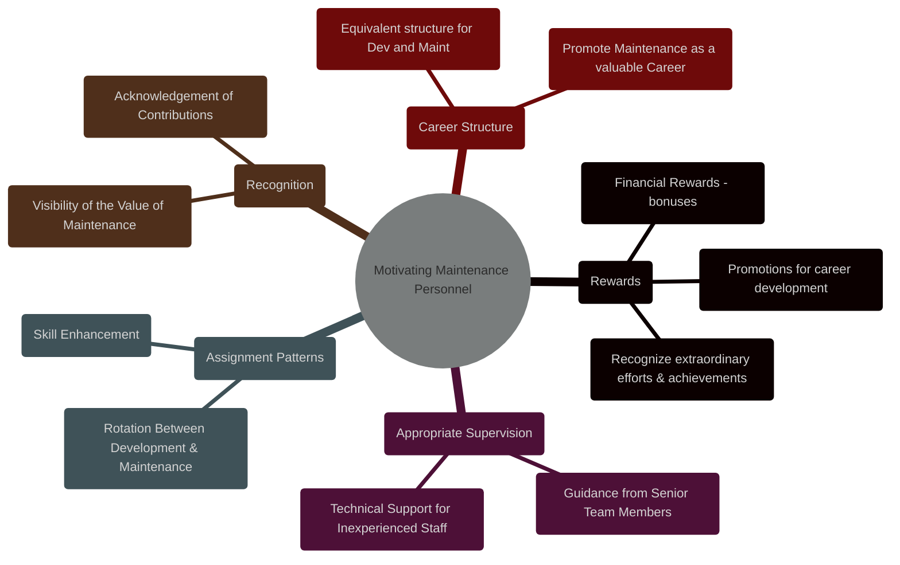
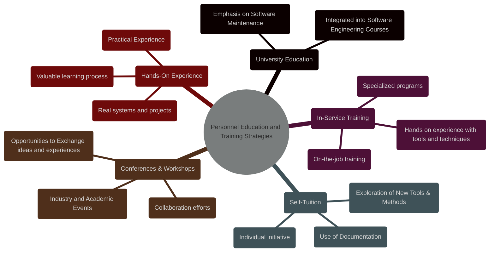
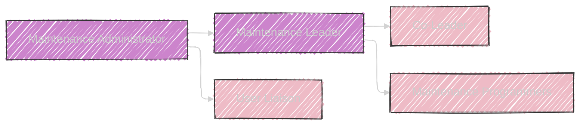

----

# Chapter 10: Management and Organizational Issues


Here are the diagrams for Chapter 10:

---


# Diagram 1: Management and Organizational Issues

```mermaid
---
config:
  layout: elk
  look: handDrawn
  theme: dark
---
mindmap
  root(("Chapter 10: <br> Management & Organizational Issues"))
    node(Introduction)
      label(Shift from Individual to Team Maintenance)
      label("Increased Complexity & Scale of Systems")
      label(Importance of Management and Organization)
    node(Definitions)
      label(Management)
      label(Team Working)
    node(Management Responsibilities)
      label(Satisfactory Quality)
      label("Timely & Economical Change")
      label(Achieved Through:)
        label(Managing Personnel)
        label(Organizing Tasks)
    node(Enhancing Maintenance Productivity)
      label(Choosing the Right People)
        label("Skills & Talent")
        label(Address Image Problem)
      node(Motivating Personnel)
        label(Rewards)
        label(Appropriate Supervision)
        label(Assignment Patterns)
        label(Recognition)
        label(Career Structure)
      node(Communication)
        label(Management to Personnel)
        label(Personnel to Management)
        label(Two-way flow)
      node(Adequate Resources)
        label("Tools - Software & Hardware")
        label(Working Environment)
        label(Sufficient Staff)
      node(Domain Knowledge)
        label(Manager's Understanding of Process)
        label(Cost Implications of Maintenance Stages)
    node(Maintenance Teams)
      label(Team Structure & Productivity)
      node(Temporary Team)
        label(Informal, Task-Specific)
        label(Rotating Leadership)
        label(Weakness:<br>Potential Quality & Morale Issues)
      node(Permanent Team)
        label(Formal, Long-Term)
        label(Specialization & Communication)
        label(Egoloess, Collegiate Atmosphere)
        label(Reduced Individual Dependency)
        label(Periodic Audits)
        label(Team Structure:)
          label("Maintenance Leader")
          label("Co-Leader")
          label("User-Liaison")
          label("Admin")
          label("Programmers")
    node(Personnel Education and Training)
      label(Importance of Education & Training)
      label(Objectives)
        node(Raise Awareness)
          label("Processes & Procedures")
          label("Development vs Maintenance Differences")
          label("Importance of Maintenance")
        node(Enhance Recognition)
          label("Value of Maintenance Work")
          label("Status Improvement")
      label(Education & Training Strategies)
        label(University Education)
        label(In-Service Training)
        label(Self-Tuition)
        label(Conferences & Workshops)
        label(Hands-on Experience)
    node(Organizational Modes)
      label(Separate or Combined Dev & Maint)
      node(Combined Development and Maintenance)
        label(Integration of Activities)
        node(Module Ownership)
          label(Owner per Module")
          label(Strength: Expertise per Module")
          label(Weaknesses:")
            label("No Overall System Responsibility")
            label("Uneven Workload")
            label("Integration Issues")
            label("Standards Enforcement Difficuly")
        node(Change Ownership)
          label("Owner per Change Request")
          label(Strengths:")
            label("System Standards Adherence")
            label("Change Integrity")
            label("Independent Coding & Testing")
            label("Code Inspection Focus")
          label(Weaknesses:")
            label("Longer Training Time")
            label("Transient Responsibilities")
        node(Work-Type)
          label("Departmentalization by Task")
          label(Strength:<br>Specialized Skills")
          label(Weakness:<br>Coordination Costs")
        node(Application-Type)
          label("Departmentalization by Application Domain")
          label(Strength:<br>Domain Expertise")
          label(Weakness:<br>Coordination Costs")
      node(Separate Maintenance Department)
        label("Distinct Department for Maintenance")
        label(Strengths:")
          label("Clear Accountability")
          label("Development Focus")
          label("Acceptance Testing Focus")
          label("User Service Focus")
        label(Weaknesses:")
          label("Potential Demotivation")
          label("Developer Knowledge Loss")
          label("High Coordination Costs")
          label("Duplicated Communication")
    node(Summary)
      label(Key Takeaways of Chapter 10)
      label(Transition to Part III)

```


This mindmap provides a comprehensive overview of Chapter 10, "Management and Organizational Issues". It breaks down the chapter into its key components, showing the hierarchy from Management Responsibilities to specific organizational modes and team structures.

---

# Table 1: Organisational Modes

```mermaid
---
config:
    themeVariables:
      darkMode: true
---
table Diagram
    title Chapter 10: Organisational Modes Comparison
    header Mode | Description | Strengths | Weaknesses
    row Module Ownership | Each person owns a module | Expertise per module | No overall responsibility, uneven workload, integration issues, standards difficult
    row Change Ownership | Each person owns a change request | System standards, change integrity, independent tasks, code inspection | Long training, transient responsibilities
    row Work-Type | Departmentalized by task type (analysis, design etc.) | Specialized skills | Coordination costs
    row Application-Type | Departmentalized by application area | Domain expertise | Coordination costs
    row Separate Maintenance Dept | Distinct dept for maintenance | Clear accountability, development focus, acceptance testing focus, user service | Potential demotivation, developer knowledge loss, high coordination costs, duplicated communication
    
```


This table provides a comparative summary of the different Organizational Modes discussed in Chapter 10, contrasting Module Ownership, Change Ownership, Work-Type, Application-Type, and Separate Maintenance Department modes based on their descriptions, strengths, and weaknesses. This tabular format facilitates quick comparison of these different approaches.

---

# Diagram 2: The Cycle of Enhancing Maintenance Productivity


This flowchart illustrates the interconnected steps in enhancing maintenance productivity as discussed in Chapter 10, creating a cycle that emphasizes the importance of each aspect, starting from personnel selection to process improvement, with a feedback loop into the process.   This demonstrates the dynamic relationship between different elements that contribute to enhancements.

---

# Diagram 3: Motivating Maintenance Personnel




This mindmap details the specific methods and strategies for motivating maintenance personnel, including Rewards, Appropriate Supervision, Assignment Patterns, Recognition and Career Structure, all of which contribute to having a valuable and productive maintenance team, as highlighted in the book.

---

# Diagram 4: Personnel Education and Training Strategies




This mindmap outlines the various strategies for personnel education and training, to further illustrate the points made in the book, which includes  University Education, In-service training, Self-tuition, Conferences and Workshops, and Hands-on Experience. This structure provides a clear view of learning methods that are available.

---

# Diagram 5: Responsibility & Structure of a Permanent Maintenance Team



This flowchart illustrates the hierarchical structure of responsibilities within a Permanent Maintenance Team, showing the flow from the Maintenance Administrator down to the programmers, showing the flow of command and decision making from the administrator to the programming team with the user liaisons as the middle.

---

# Diagram 6: Organizational Modes - Table (Expanded)

```mermaid
---
config:
    themeVariables:
      darkMode: true
---
table Diagram
    title Chapter 10: Organizational Modes with Detailed Strengths & Weaknesses
    header Mode | Structure Description|  Key Strengths | Key Weaknesses
    row Module Ownership | One person per module, responsible for all changes | Expertise within a single area | Lacks overall system responsibility, uneven workload, high integration complexity, difficult to enforce standards.
    row Change Ownership | One person takes ownership of a task across multiple modules | Adherence to system-wide standards, ensures change integrity, promotes independent testing, promotes rigorous code review | High training overhead for personnel, limited long lasting responsibility.
    row Work-Type | Specializes teams by type of work (analysis, implementation etc) | Departmentalization allows for specialisation, develops expertise in specific areas | Requires greater cross-departmental coordination, harder to establish project accountability
    row Application-Type | Specializes teams by application domain | Team members develop a strong understanding of a specific application area | Requires greater inter-team communication and coordination. Can also require duplication of certain services.
    row Separate Maintenance Dept | A distinct department focusing on maintenance activities | Clear lines of accountability, allows dev teams to focus on dev tasks and promotes better user support.  | Potential demotivation among staff, developers can lose touch, high cost to coordinate activities, duplication of communication processes
```

This expands upon the previous table by adding a descriptive column detailing the structure of each mode. Additionally, strengths and weaknesses have been expanded to provide more context and specific examples of issues that can arise.  This table goes into more detail regarding the structure, strengths and weaknesses of the different organizational modes discussed in the book.


----
