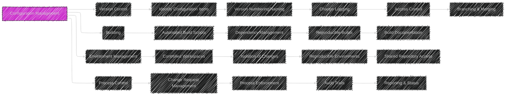
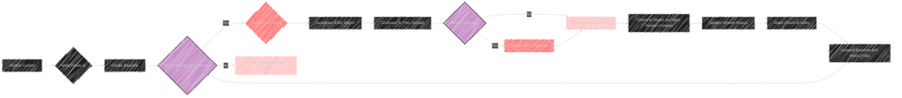
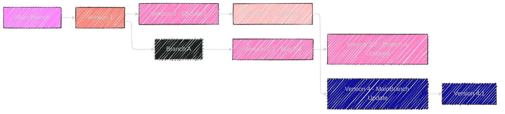

----

# Chapter 11: Configuration Management

Below are diagrams and illustrations provide a visual summary of Chapter 11, breaking down the concepts of Configuration Management and Change Control into understandable segments using Mermaid syntax.


----


# Diagram 1: Configuration Management - Mindmap

```mermaid
---
config:
  layout: elk
  look: handDrawn
  theme: dark
---
mindmap
  root((Chapter 11:<br>Configuration Management))
    node(Introduction)
      label(Importance of CM)
      label(Control of Software Change)
      label(Maintaining Product Integrity)
    node(Definitions)
      label(Key Terminology)
        label(Configuration)
        label("Configuration Management <br> (CM)")
        label(Software Configuration)
        label("Software Configuration Management <br> (SCM)")
        label(Baseline)
        label(Version)
        label(Variant)
        label(Change Control)
        label(Documentation)
        label(Life-Cycle)
        label(Process)
        label(Model)
        label(Software Maintenance Process)
    node(Configuration Management)
      label(Purpose of CM)
        label(Control of Evolution)
        label(Product Reproducibility)
      label(Objectives of CM)
        label(Control)
        label(Consistency)
          label(Consistent Sets of Documents)
          label(Consistent Software Releases)
        label(Minimising Cost)
      label(Components of Software Configuration Management)
        label(Version Control)
        label(Building)
        label(Environment Management)
        label(Process Control)
    node(Change Control)
      label(Definition & Purpose)
      label(Activities of Change Control)
        label(Selection from Priority List)
        label(Problem Reproduction)
        label(Code Analysis)
        label(Change Incorporation)
        label(Design of Changes & Tests)
        label(Quality Assurance)
      label(Management Responsibilities)
        label(Deciding if Change is Needed)
        label(Managing Implementation)
        label(Verifying Quality)
    node(Documentation)
      label(Importance of Documentation in CM)
      node(Categories)
        label(User Documentation)
          label(System Overview)
          label(Installation Guide)
          label(Beginner's Guide/Tutorial)
          label(Reference Guide)
          label(Enhancement Booklet)
          label(Quick Reference Card)
          label(System Administration)
        node(System Documentation)
          label(Specification/Requirements)
          label(Design)
          label(Implementation)
          label(System Test Plan)
          label(Acceptance Test Plan)
          label(Data Dictionaries)
    node(Summary)
      label(Key Takeaways of Chapter 11)

```


This mindmap provides a hierarchical overview of Chapter 11, starting with the core concept of Configuration Management and branching out to cover definitions, objectives, key components, Change Control and the pivotal role of Documentation within CM.

---

# Diagram 2: Configuration Management Processes




This flowchart illustrates the four core processes within Configuration Management as presented in Chapter 11. For each process (Version Control, Building, Environment Management, Process Control), it outlines key sub-activities and goals, providing a clearer picture of their respective roles in CM.

---

# Diagram 3: Change Control Process


This flowchart details the steps within a typical Change Control process, as discussed in Chapter 11. It begins with a change request and progresses through submission, impact analysis, CCB review, implementation, testing, approval, and finalization, clearly showing the workflow and decision points.  Color-coding is used to highlight decision points (yellow) and rejection paths (red).

---


# Diagram 4: Version Control Activities



This flowchart illustrates the step-by-step process of version control, from initial check-in to creating a new version. It includes decision points for modification needs and highlights steps for merging code changes and updating history.

---

# Diagram 5: Types of Documentation

```mermaid
---
config:
 themeVariables:
      darkMode: true
---
table Diagram
    title Chapter 11: Documentation Types
    header  Type | Description | Intended Audience
    row User Documentation | Describes system functions from user perspective without implementation details | End-Users/Clients
    row System Documentation | Describes all aspects of the system &  how it works under the hood | Developers, Maintainers, Technical Staff
    row System Overview | Provides a broad overview of  system function, usage | End-Users, Management
    row Installation guide | Detailed explanation to setup & configure a specific system | System Admins, Technical Staff
    row Beginner's guide/tutorial | Provides basic instructions with a guided learning approach for general use | New Users, non-technical staff
    row Reference Guide | Detailed documentation on individual features and function  | All Users, Technical Staff
    row Enhancement Booklet | Summary of the new features and improvements | End-Users
    row Quick Reference Card | Short factual lookup and reminder on key points| All Users
    row System Administration Guide | Detailed guide of  administration of operation, security and upgrades | System Admins, Technical Staff
    row Functional Specification | Details of the functional and non functional requirements, agreements| Project Stakeholders, Developers
    row System Design Documentation | System Architecture, Design Details & interactions| Programmers, Designers, QA
    row Implementation Documentation | Technical details on source code organization, implementation guidelines | Developers, fellow code reviewers
    row System test plan | Strategies, and procedures on how to test | Verification Teams, Testers
    row Acceptance test plan | Documents tests and conditions for user acceptance | Stakeholders, Clients & End Users
    row Data Dictionaries | Documents describing  all data terms, structure and requirements | Developers, DBAs, Data Scientists

```


This table summarizes various categories of user and system documentation as described in Chapter 11. It outlines what is included in each type of document and who the intended audience is, and explains its purpose

---

# Diagram 6: Software Configuration Management Components

```mermaid
---
config:
  layout: elk
  look: handDrawn
  theme: dark
---
mindmap
  root((Software Configuration Management Components))
        node(Version Control)
          label(Identify different versions, Changes, History)
          label(Support Parallel Development)
          label(Branching & Merging)
          label(Manage and Track changes)
        node(Building)
          label(Reproducible Builds)
          label(Ensure appropriate objects & Versions are used)
          label(Automated Build Scripts)
          label(Dependency Management)
        node(Environment Management)
          label(Reproducible Environments)
          label(Controlled Workspaces)
          label(Share & Isolate Objects)
        node(Process Control)
          label(Manage & Enforce Processes)
          label(Change Request & Reporting)
          label(Audit Trails)

```

This mindmap visually structures the four main components of Software Configuration Management as mentioned in Chapter 11, (Version Control, Building, Environment Management, and Process Control). For each, it details key functions and goals in a clear and concise manner.

---

# Diagram 7: Version Control Concepts



This diagram gives a visual, non-technical example of branching in version control, showing a development path and how new versions and branches can appear as a result of updates, bug fixes, and new features. This more illustrates in practice what is represented in Chapter 11 as part of the software CM, especially in the version control sections.


----
