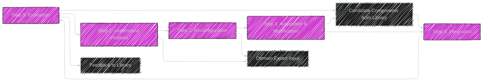
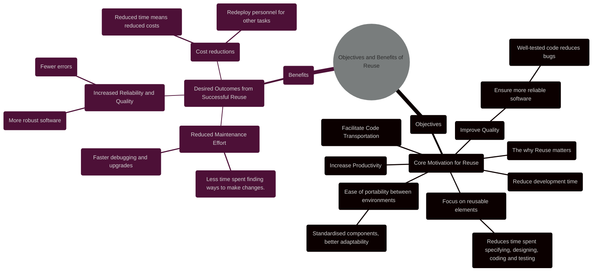
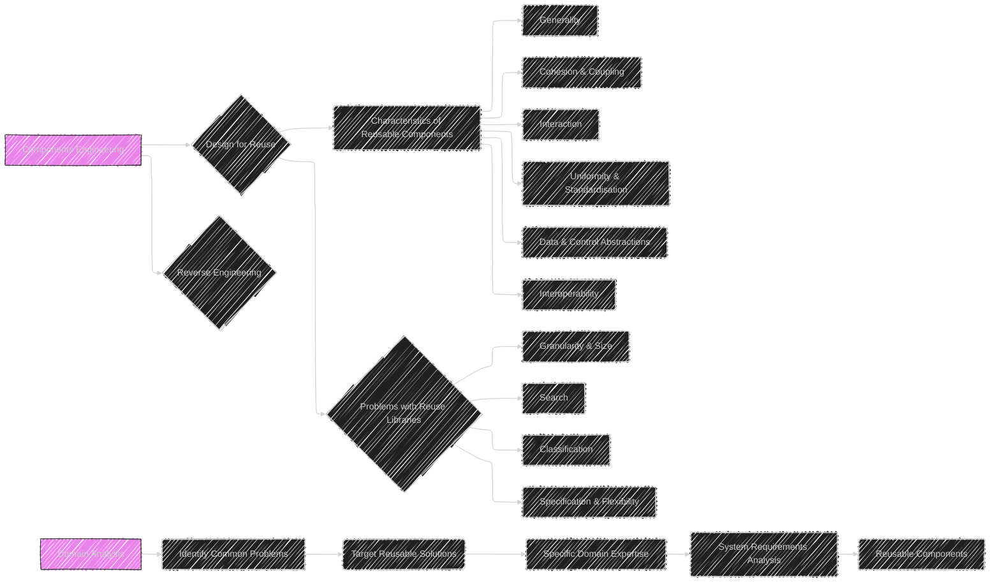

----


# Chapter 8 - Reuse and Reusability

Here are the diagrams and illustrations Mermaid syntax to cover its concepts:

---

# Diagram 1: Overview - Mindmap

```mermaid
---
config:
  layout: elk
  look: handDrawn
  theme: dark
---
mindmap
  root((Chapter 8: Reuse and Reusability))
    node(Introduction)
      label(Addressing Low Productivity & Quality)
      label(Software Reuse as Solution)
      label(Benefits of Reuse)
    node(Definitions)
      label(Reuse - Broad Concept)
      label(Reusability - Component Attribute)
    node(Targets for Reuse)
      label(Process)
      label(Personnel)
      node(Product)
        label(Data)
        label(Design)
        label(Program)
    node(Objectives & Benefits)
      label(Increase Productivity)
      label(Improve Quality)
      label(Facilitate Code Transportation)
      label(Reduce Maintenance Effort)
    node(Approaches to Reuse)
      label(Composition-Based Reuse)
      label(Generation-Based Reuse)
    node(Domain Analysis)
      label(Identifying Reusable Knowledge)
      label(Domain-Specific Solutions)
    node(Components Engineering)
      label(Design for Reuse)
      label(Reverse Engineering for Reuse)
      label(Components-Based Processes)
    node(Reuse Process Model)
      label(Generic Reuse/Reusability Model)
      label(Integrating Reuse in Life-Cycle)
    node(Factors Impacting Reuse)
      label(Technical Factors)
      label(Non-Technical Factors)
    node(Case Study)
      label(Patient Identification - ACME Clinic)
    node(Summary)
      label(Key Chapter Takeaways)

```

This mindmap provides a chapter-level overview of Chapter 8, structuring the main topics discussed within "Reuse and Reusability."

---

# Diagram 2: Approaches to Reuse - Detailed Mindmap

```mermaid
---
config:
  layout: elk
  look: handDrawn
  theme: dark
---
mindmap
  root((Approaches to Reuse))
    node(Composition-Based Reuse)
      label(Atomic Building Blocks)
      label(Reusable components as building blocks)
      label(Assembled to compose target system)
      label(Components retain characteristics)
      label(Composition Mechanisms)
      label(e.g., UNIX pipe, Inheritance)
      node(Types)
        node(Black-box Reuse)
          label(Reuse without Modification)
          label(Users see 'What' - Functionality)
          label(Implementation hidden)
          label(Examples)
            label(Math Libraries)
            label(Standard Routines)
        node(White-box Reuse)
          label(Reuse with Modification)
          label(Users see 'How' - Implementation)
          label(Requires Source Code Access)
          label(Customization Allowed)
    node(Generation-Based Reuse)
      label(Reusable Components - Generators)
      label(Generators create target systems)
      label(Output differs from Generator)
      node(Types)
        node(Application Generator Systems)
          label(Domain-Specific Generators)
          label(Automatic Code Generation)
          label(Specification-Driven)
          label(Examples)
            label(YACC)
            label(Draco)
        node(Transformation-Based Systems)
          label(High-Level Spec to Operational Code)
          label(Transformation Process)
          node(Step-wise Refinement)
            label(Incremental Detail addition)
            label(Gradual conversion)
          node(Linguistic Transformation)
            label(Intermediate Languages)
            label(Language-Based Systems)
            label(e.g., SETL)

```


This mindmap drills down into the "Approaches to Reuse" discussed in Chapter 8, providing a detailed breakdown of Composition-Based and Generation-Based Reuse, including their types and characteristics.

---

# Diagram 3: Factors Impacting Reuse

```mermaid
---
config:
  layout: elk
  look: handDrawn
  theme: dark
---
mindmap
  root((Factors Impacting Reuse))
    node(Technical Factors)
      label(Programming Languages)
        label(Language Variety Hinders Reuse)
        label(Standardization Encourages Reuse)
      label(Representation of Information)
        label(Design Info Format)
        label(Reusable Design Representation)
      node(Reuse Library)
        label(Component Accessibility)
        label(Effective Library Management)
        label(Search & Classification Challenges)
      node(Reuse-Maintenance Vicious Cycle)
        label(Growing Library Complexity)
        label(Management Overhead)
        label(Need for Good Design Principles)
    node(Non-Technical Factors)
      label(Initial Capital Outlay)
        label(High Start-up Costs)
        label(Long-Term Investment)
        label(Risk Perception)
      label("Not Invented Here (NIH) Factor")
        label(Cultural Resistance)
        label(Programmer Preference for New Code)
        label(Need Cultural Shift)
      label(Commercial Interest)
        label(Proprietary Components)
        label(Profit Motive vs. Public Domain)
      label(Education)
        label(Managerial Understanding)
        label(Awareness of Reuse Benefits)
      label(Project Co-ordination)
        label(Lack of Central Coordination)
        label(Duplication of Effort)
      label(Legal Issues)
        label(Patents & Copyright)
        label(Liability Concerns)
        label(Unclear Legal Framework)

```


This mindmap details the "Factors Impacting Reuse" from Chapter 8, categorizing them into Technical and Non-Technical Factors, and listing specific points under each category for a comprehensive overview.

---

# Diagram 4: Reuse Process Model




This flowchart represents the "Reuse Process Model" detailed in Chapter 8, breaking down the model into five key steps: Understand Problem, Reconfiguration, Acquisition & Modification, Integration, and Evaluation. It also indicates the inputs and feedback loops in the process.

---

# Table 1: Targets for Reuse

```mermaid
---
config:
    themeVariables:
      darkMode: true
---
table Diagram
    title Chapter 8 : Targets for Reuse
    header Target | Description | Examples | Considerations
    row Process | Reapplication of Methodologies | Project Management, Cost Estimation, Development Steps | Requires clear, repeatable and flexible methodologies
    row Personnel | Reuse of Domain Expertise  | Experienced developers, domain experts, lessons learned | Can be difficult to transfer, dependent on individuals’ skills
    row Product | Reusing deliverables from prior Projects | Code, Design, Data | Needs careful cataloguing, versioning, and adaptation techniques
        row Data | Reusing the data and its format | File structures, databases, schemas, external files, record layouts  | Requires suitable interfaces for sharing and transformation
        row Design | Reusing architectural and detailed design components | system architectures, object models, data flow diagram | Requires proper design documentation that is easy to understand and modify
		row Program  | Reusing code components | Modules, procedures, libraries, functions, templates, frameworks  | Requires modular design and good understanding of function
```


This table breaks down the "Targets for Reuse" from Chapter 8. It specifies each target, its description, the examples of what form they might be and considerations about each target.

---

# Diagram 5: Objectives and Benefits of Reuse



This mindmap visualizes  the "Objectives and Benefits of Reuse" in an easy to understand manner of its main points, showing what the core objectives of reuse are and the benefits that can be expected.

---

# Diagram 6: Components Engineering and Domain Analysis



This diagram illustrates the "Components Engineering" and "Domain Analysis" concepts from Chapter 8. It depicts Components Engineering leading to either Design for Reuse aspects or Reverse Engineering. Domain Analysis is shown to target Reusable Solutions, facilitated by expert knowledge and good system analysis.

---

# Diagram 7: Factors Impacting Reuse

```mermaid
---
config:
    themeVariables:
      darkMode: true
---
table Diagram
    title Chapter 8: Factors That Impact Reuse
    header Factor |  Description  | Consequence
    row Initial Capital Outlay | High upfront costs of setting up reuse infrastructure  | Difficulty in adoption if low-budget
    row Not Invented Here (NIH) Factor |  Cultural resistance to using external code | Undermines reuse potential, preference for new code.
    row Commercial Interest |   Software authors prioritize profits over sharing | Reduced availability of public components.
    row Education | Insufficient understanding of benefits or implementation | Limits potential adoption and practice.
    row Project Coordination | Poor cooperation between teams on reuse  | Duplicated effort and missed reuse opportunities.
    row Legal Issues | lack of clarity on reuse rules and legal frameworks  |  Inhibits reuse among external entities and projects
    row Programming Languages  | Diversity among Programming Languages in different projects    | Difficulty to share common components and promote reuse
        row Representation of Information   | Insufficient use of appropriate format for the reuse of design | Difficulty sharing design and reuse of code components
        row Reuse Library   | Inability to easily access and use reuse library   | Reduces usability of reuse and access of library
    row Reuse-Maintenance Vicious Cycle  |   Effort involved in maintaining a large reuse libraries | Diminished gains or even negative returns from reuse programs

```

This table summarizes the key factors impacting reuse from Chapter 8. It includes the name of each factor, a description of its meaning and a clear representation of the consequence that factor has on reuse.

---
