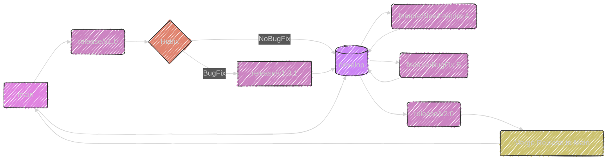

---

Below are two subjects related to Chapter 11 (Configuration Management), viewed through the lens of an experienced iOS developer.

----

# Subject 1: Branching Strategies in a Collaborative iOS Development Environment

**Context:** In Chapter 11, version control is mentioned as a core part of configuration management. As an experienced iOS developer, I know that effective branching strategies are essential for navigating the complexities of collaborative development, especially when dealing with large projects, multiple features, and frequent releases.

**iOS Developer's Perspective:**

*   **The Challenge of Parallel Development:** In iOS development, we don't work in isolation. Multiple developers might be concurrently working on different features, bug fixes, or experimental changes for the same project. Without a well-defined branching strategy, chaos ensues: code conflicts become frequent, bug fixes get mixed with feature changes, and the risk of destabilizing the *main* branch becomes high.

*   **Gitflow as a Common Approach:** Many iOS teams rely on Gitflow or something similar. This strategy involves using:
    *   `main` branch: Represents the production-ready state.
    *   `develop` branch: Integrates all stable feature development.
    *   `feature` branches: Individual branches for each new feature of your application.
    *   `release` branches:  Used to prepare a release, and freeze the features in preparation to make sure, it will be fully tested.
    *   `hotfix` branches: Addresses critical issues post-release using a hotfix branch, often developed from a `main` branch.
*   **Why Gitflow works for iOS:** iOS ecosystem is one where app updates are pushed frequently, this approach allows us to be flexible about features, and at the same time being stable about releases, using `release` branches in a smart way. It also makes it easier to manage code for multiple app versions simultaneously.
*   **Dealing with Swift Package Manager (SPM):** Gitflow is not only for your code base. It also works well for a mixed source environment. As an example, if you also depend on third-party libraries distributed using SPM and if the third party release a new update, a new `feature` branch can spin off and test the upgrade in an isolated environment, before merging back to `develop` branch.
*     **Code Review Implementation from a Branching Perspective:** An effective code review process is crucial. Before merging `feature` branches back into `develop`, all code must be reviewed which will help to reduce bugs, and enforce high standards among the development team. The code review process may not only consist of technical merits, but also performance and architecture best practices for a specific project.
*   **Tools and Automation:** Tools like Xcode's built-in source control integration, command line git, and platforms like Bitbucket, GitHub, and GitLab are crucial for managing branches, code review, pull requests. CI/CD (Continuous Integration/Continuous Deployment) pipelines are also essential, to manage releases automatically and deploy application in different environments.
*   **Practical Learnings**: I have seen many projects where not having a suitable merging strategy has resulted in the source code being out-of-sync with the releases. This creates a lot of frustration and instability. A good branching strategy is critical, and should always be prioritized on collaborative environments.

---

## Diagram: Gitflow Branching Strategy for iOS Development

Here's a Mermaid diagram illustrating the Gitflow branching strategy discussed in this subject, focused on its use in an iOS development context:

This diagram represents the core structure and flow of Gitflow, particularly with iOS development in mind.

*   **`main` Branch (Blue Node):**: The central branch, representing the production-ready code.
*   **`develop` Branch (Purple Node):**: Where features and minor changes merges after code review.
*   **`feature` Branches (Grey Nodes):**: Individual branches (e.g., `feature/NewFeature A`) are created for new features, and will eventually merge back  into `develop`
*    `hotfix` branches (Light-Blue Nodes): spin of for any post release issues and merge into `main`, and then `develop`.
*    `release` branches (Yellow Nodes): used to freeze, stabilize and test in preparation for a new application release.

This diagram should provide a clear visual illustration of how Gitflow works in a typical iOS development environment. This is often implemented in various iOS projects, and has the objective of making the development and release process more organized.

----

# Subject 2: Configuration Management of Xcode Projects and Build Settings

**Context:** Chapter 11 mentions the importance of "Building" and "Environment Management" within configuration management. For an iOS developer, this translates directly to the intricate world of Xcode project management and build settings configuration.

**iOS Developer's Perspective:**

*   **The Complexity of Xcode Projects:** Xcode projects, especially for large apps, are not simply about organizing source code. They involve complex build settings, schemes, targets, Info.plist files, asset catalogs, and dependencies. Managing and versioning these elements consistently forms a part of this CM.

*  **Importance of Build Settings Configuration**: Setting the correct configuration for build phases, such as defining the code signing identities, compilation flags, target frameworks, frameworks search paths, etc. is an error prone, and tedious task. If not properly setup, can lead to instability, not only the compilation process, but also during deployment stage of the app life cycle.
*   **Understanding Xcode Schemes:** Xcode schemes determine what gets built, how it gets built, and where it runs. They're essential for managing different build configurations (e.g., debug, release, staging) and should be versioned as well. Configuration Management (CM) approach should include different targets for different versions of the app, e.g. free versions, versions with in app purchases, beta versions, and the final versions deployed to app store.
*    **Beyond the Xcode UI:** Many iOS developers use `xcconfig` files to manage build settings, since they are textual files and are easier to control, and it also makes it easier to compare the different configurations over time. Also, this is the way to have a more granular control over configurations that can't be simply done with XCode UI, and is often the standard for many big iOS development teams.
*  **Info.plist and Asset Catalogs:** These files and catalogs are also configuration elements, in form of non-binary files, since they are used as entry points for the system. So, they must also be included as part of the configuration management process, to keep track of changes. This includes application names, versioning, assets such as the application icon, images, audio files etc...
*   **Dealing with Swift Packages:** As an iOS developer, I need to manage a mix of internal code and libraries and also other third party dependencies using SPM. Version control needs to be applied to those files, and an understanding of transitive dependencies must be kept. An incorrect version of a package could lead to compilation or runtime errors. This highlights the importance of a shared and controlled, centralized location for source code storage, that handles different dependencies and relationships.
*   **Automation and CI/CD:** Continuous Integration and Continuous Deployment (CI/CD) pipelines, using tools like Jenkins, GitLab ci or GitHub Actions, become very essential. These pipelines automatically builds, tests and deploys the applications. Such environments should be well integrated to CM to fetch code from the right branch, apply the right build settings, and be able to revert configurations in case something goes wrong.
*   **Practical Learnings:** In my personal experience, incorrect handling of build settings, configurations and Info.plist files have been the source of much instability. So, a detailed understanding of configuration management is required to prevent issues at different stages of an iOS app life cycle. Automating build processes using scripting is invaluable.

**Summary:**

Both of these subjects are crucial for any experienced iOS developer and highlight practical components of Configuration Management that are often overlooked but essential for producing robust and maintainable applications. Understanding these concepts moves beyond academic knowledge and relates directly to day-to-day development challenges for experienced developers. These real-world applications demonstrate the essential role that CM plays in iOS projects.

----
