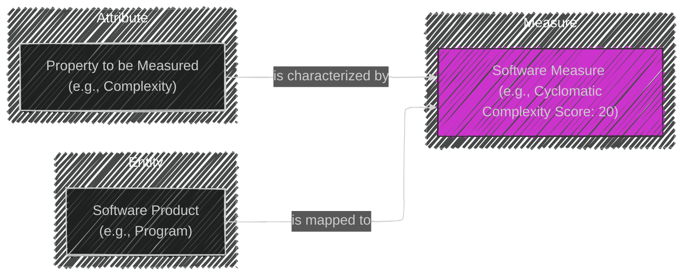
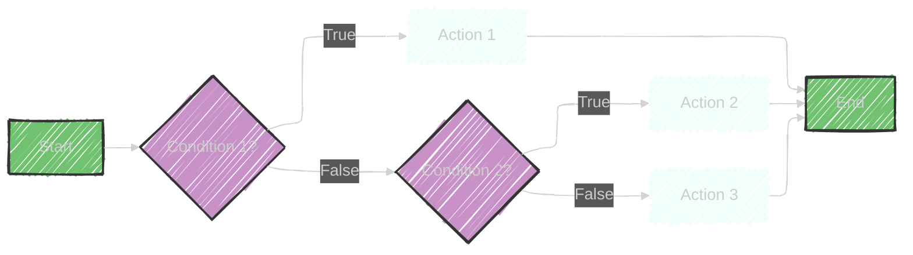
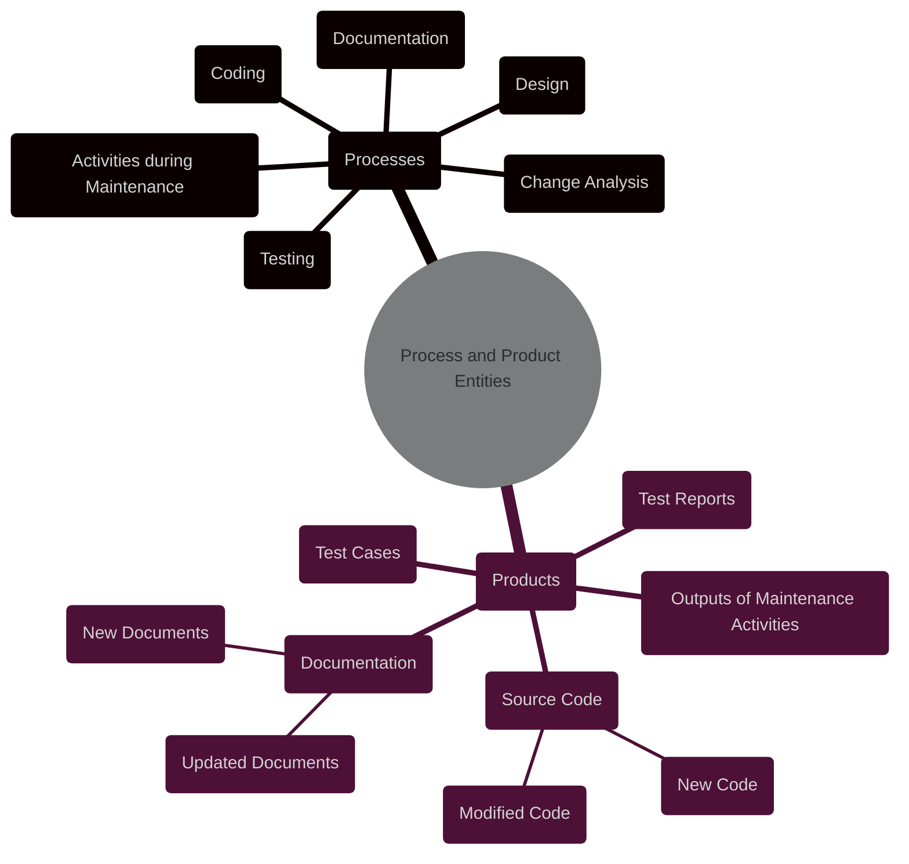
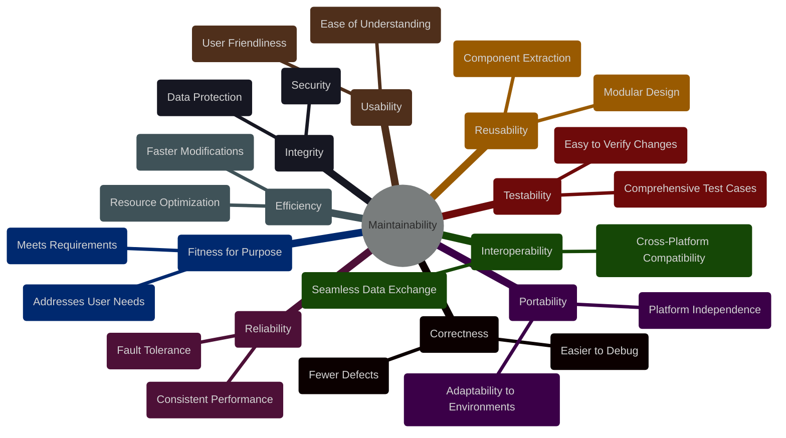
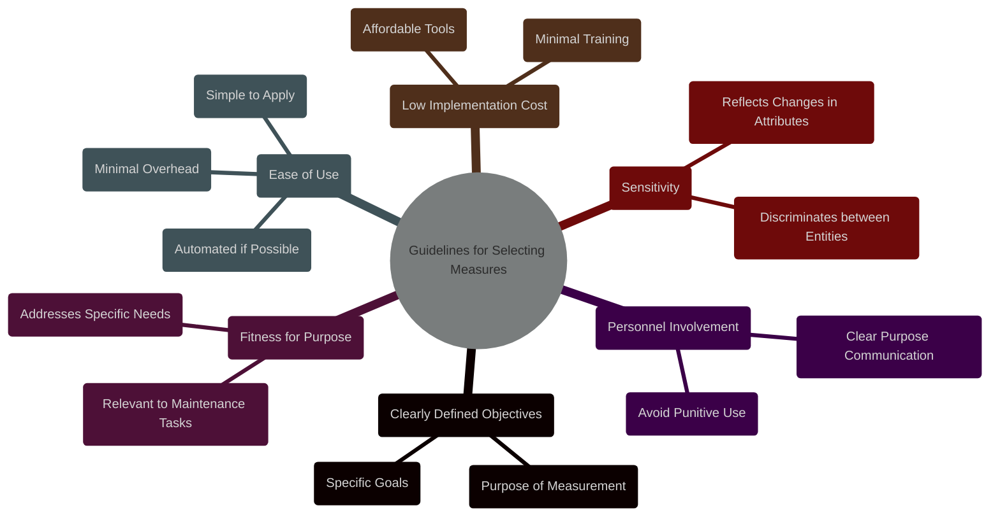

# Chapter 12: Maintenance Measures


## Diagram 1: Mindmap Overview

```mermaid
---
config:
  layout: elk
  look: handDrawn
  theme: dark
---
mindmap
  root((Chapter 12: <br>Maintenance Measures))
    node(Definitions)
      label(Measurement)
      label(Software Measurement)
      label(Software Measure)
      label(Software Metric)
    node(Importance of Integrity)
      label(Empirical)
      label(Objective)
      label(Encodable)
    node(Objectives of Measurement)
      label(Evaluation)
      label(Control)
      label(Assessment)
      label(Improvement)
      label(Prediction)
    node(Example Measures)
      label(Size)
      label(Complexity)
        label(McCabe's Cyclomatic)
        label(Halstead's Measures)
      label(Quality)
        label(Product Quality)
        label(Process Quality)
      label(Understandability)
      label(Maintainability)
      label(Cost Estimation)
    node(Guidelines for Selection)
      label(Clearly Defined Objectives)
      label(Fitness for Purpose)
      label(Ease of Use)
      label(Low Implementation Cost)
      label(Sensitivity)
      
```


This Mindmap provides a hierarchical overview of Chapter 12, covering the main sections and sub-topics: Definitions, Importance of Integrity, Objectives, Example Measures and Guidelines.

---

## Table 1: Importance of Integrity in Measurement

```mermaid
---
config:
    themeVariables:
      darkMode: true
---
table Diagram
    title Chapter 12: Integrity in Measurement
    header Characteristic | Description | Importance
    row Empirical | Verified by observation or experiment         | Ensures measures are based on real-world evidence
    row Objective  | Unbiased, Reliable, Efficient, Unambiguous      | Guarantees consistent and repeatable measurements
    row Encodable  | Expressed in formal symbols (numbers)         | Allows quantitative analysis and comparison
    
```

This Table details the three key characteristics of integrity in measurement: Empirical, Objective, and Encodable. It explains the description and importance of each characteristic for software measurement.

---

## Diagram 2: Relation between Entity, Measure, and Attribute




This Flowchart illustrates the relationship between an *Entity* (Software Product), an *Attribute* (Property to be Measured), and a *Measure* (Software Measure). It visually explains how a measure maps an entity to a quantifiable representation of an attribute.

---

## Table 2: Objectives of Software Measurement

```mermaid
---
config:
    themeVariables:
      darkMode: true
---
table Diagram
    title Chapter 12: Objectives of Software Measurement
    header Objective | Description | Benefit
    row Evaluation   | Comparing methods, tools, components | Informed decision-making, optimal selection
    row Control      | Managing change, tracking progress, budgets | Process visibility & efficiency, project management
    row Assessment   | Characterizing product/process, feasibility |  Understanding current state, informed strategic decisions
    row Improvement  | Monitoring enhancements, setting targets |  Quality & productivity gains, continuous improvement
    row Prediction   | Estimating resource, time, effort for tasks |  Resource allocation, project planning, risk mitigation
    
```


This table outlines the Objectives of Software Measurement: Evaluation, Control, Assessment, Improvement and Prediction, detailing the description and benefit of each objective in the context of software maintenance.

---

## Diagram 3: Example Measures - Mindmap

```mermaid
---
config:
  layout: elk
  look: handDrawn
  theme: dark
---
mindmap
  root((Chapter 12: <br>Example Measures))
    node(Size)
      label("Lines of Code <br> (LOC)")
      label(Delta LOC)
      label(Measure Program Size)
    node(Complexity)
      label(McCabe's Cyclomatic Complexity)
        label(Control Flow Paths)
        label(Psychological Complexity)
      node("Halstead's Measures")
        label(Program Length)
        label(Program Effort)
        label(Software Science)
    node(Quality)
      node(Product Quality)
        label(User Change Requests)
        label("Post-Operation Faults")
        label(Customer Satisfaction)
      node(Process Quality)
        label(Schedule Variance)
        label("Productivity <br> (LOC/Person-Days)")
        label(Efficiency of Maintenance Process)
    node(Understandability)
      label(Inverse of Complexity)
      label(Documentation Quality)
      label(Coding Style Consistency)
      label(Ease of Program Comprehension)
    node(Maintainability)
      label("Mean Time To Repair <br> (MTTR)")
      label(External Attribute)
      label(Time to Effect Change)
    node(Cost Estimation)
      label(Historical Data)
      label(Mathematical Models)
      label("Boehm's COCOMO")
      label(Predicting Maintenance Effort)

```


This mindmap expands on the "Example Measures" section, breaking down each measure type (Size, Complexity, Quality, Understandability, Maintainability, Cost Estimation) into further details and specific examples like McCabe's and Halstead's measures.


----


## Diagram 4: McCabe's Cyclomatic Complexity




This flowchart visually represents a simple program with conditional statements. It can be used to illustrate how McCabe's Cyclomatic Complexity is calculated based on the number of linearly independent paths through the code.

*   **Nodes:** (e.g., A, B, C, D, E, F, G) represent program statements.
*   **Edges:** (arrows) represent the flow of control.
*   **Decision Points:** (e.g., B, D) are conditions that create branching paths.

**Formula:**

*   v(F) = e - n + 2
*   e = number of edges (arrows)
*   n = number of nodes

**In this example:**

*   e = 7
*   n = 7
*   v(F) = 7 - 7 + 2 = 2

**Interpretation:**

*   The Cyclomatic Complexity of this program is 2. This value can indicate the program's testability and understandability. Higher values generally imply more complex code that is harder to test and understand.

---

## Diagram 5: Halstead's Measures

```mermaid
---
config:
    themeVariables:
      darkMode: true
---
table Diagram
    title Chapter 12: Halstead's Measures
    header Metric | Formula | Description
    row Unique Operators | n₁ | Number of unique operators (e.g., +, -, *, IF, WHILE)
    row Unique Operands | n₂ | Number of unique operands (e.g., variables, constants)
    row Total Operators | N₁ | Total occurrences of operators
    row Total Operands | N₂ | Total occurrences of operands
    row Program Length | N = N₁ + N₂ | Total number of operators and operands
    row Calculated Program Length | N̂ = n₁log₂(n₁) + n₂log₂(n₂) | Estimated program length based on unique operators and operands
    row Program Effort | E = (n₁N₂(N₁ + N₂)*log₂(n₁ + n₂)) / (2 * n₂) | Measure of the mental effort required to create or understand a program
```


This table explains the key metrics used in Halstead's Software Science, including the basic counts (n₁, n₂, N₁, N₂) and the derived metrics (N, N̂, and E). It clarifies what constitutes an operator and an operand, providing a foundation for understanding these measures.

---

## Diagram 6: Process and Product Entities



This mindmap distinguishes between *Processes* (activities performed during maintenance) and *Products* (the outputs of those activities). It clarifies that both processes and products can be measured, providing examples of each.

---

## Diagram 7: Relationship between Maintainability and Other Quality Factors



This mindmap illustrates how other quality factors contribute to maintainability. Each factor is linked to maintainability, showing that a system that scores high on these factors is likely to be more maintainable.

---

## Diagram 8: Guidelines for Selecting Measures




This mindmap summarizes the key guidelines for selecting appropriate maintenance measures, emphasizing the importance of clear objectives, fitness for purpose, ease of use, cost, sensitivity and personnel involvement.

---

These additional diagrams and tables provide a more detailed visual representation of the core concepts within Chapter 12, including:

*   **McCabe's Cyclomatic Complexity:** Visualized using a flowchart to demonstrate how paths are counted.
*   **Halstead's Measures:** Explained in a table format, defining each metric and its formula.
*   **Process and Product Entities:** Differentiated using a Mindmap to show examples of measurable entities during maintenance.
*   **Relationship between Maintainability and Other Quality Factors:** Illustrated with a Mindmap to demonstrate how each factor contributes to maintainability.
*   **Guidelines for Selecting Measures:** Summarized in a Mindmap, highlighting key considerations for choosing appropriate measures.


----
