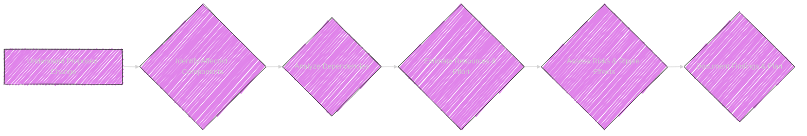
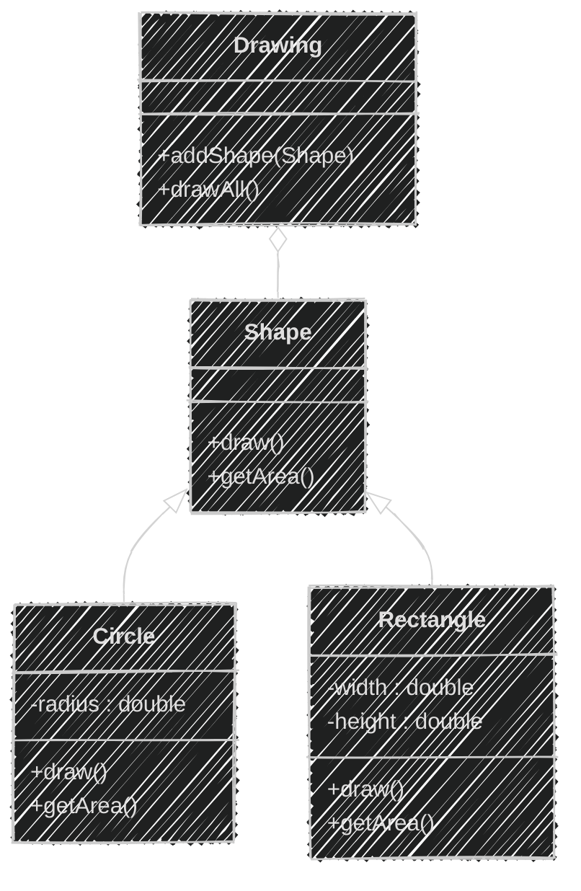
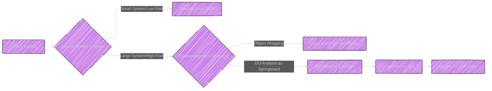
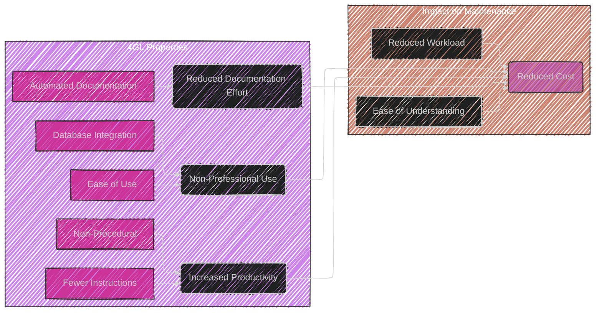

----

# Chapter 13 - Building and Sustaining Maintainability


Below are the Mermaid diagrams and illustrations of this chapter.

----


# Diagram 1: Building and Sustaining Maintainability - Mindmap Overview

```mermaid
---
config:
  layout: elk
  look: handDrawn
  theme: dark
---
mindmap
  root((Chapter 13: <br> Building and Sustaining Maintainability))
    node(Introduction)
      label(Focus on building better systems)
      label(Applying lessons from previous parts)
    node(Definitions)
      label(Impact Analysis)
      label(Quality Assurance)
      label(Maintainability)
    node(Impact Analysis)
      label(Crucial for Maintainability)
      label(Models and Strategies)
      label(Example: 'Year 2000 Problem')
    node(Quality Assurance)
      label(Key to Maintainability)
      label(Quality Factors)
        label(Fitness for Purpose)
        label(Correctness)
        label(Portability)
        label(Testability)
        label(Usability)
        label(Reliability)
        label(Efficiency)
        label(Integrity)
        label(Reusability)
        label(Interoperability)
    node("Fourth-Generation Languages <br> (4GLs)")
      label(Properties for Maintainability)
      label(Impact on Maintenance)
        label(Increased Productivity)
        label(Cost Reduction)
        label(Ease of Understanding)
        label(Automatic Documentation)
        label(Workload Reduction)
      node(Weaknesses of 4GLs)
        label(Application-Specific)
        label(Proprietary)
        label(Hyped Ease of Use)
        label(Poor Design Potential)
    node("Object-Oriented Paradigms <br> (OOP)")
      label(Decomposition for Comprehension)
        label(Algorithmic Decomposition)
        label(Object-Oriented Decomposition)
      label(Impact on Maintenance)
        label(Smaller Systems)
        label("Resilient to Change <br> [Evolvability]")
        label(Reduced Risks - Incremental Development)
        label(Reusable Components)
      node(Migration to OOP)
        label(Approaches)
          label(Rewrite Whole System)
          label(OO Analysis as Springboard)
          label(Object Wrapping)
        label(Retraining Personnel)
    node(Case Study - Usability)
      label(Usability as Key Quality Factor)
      label(ACME Health Clinic - 'Software Airbag' Example)
    node(Summary)
      label(Recap of Key Concepts)
      label(Transition to Maintenance Tools - Chapter 14)

```

This mindmap gives a structured overview of Chapter 13, outlining the main sections and topics covered, from Impact Analysis to Object-Oriented Paradigms and the concluding Summary and transition.

---

# Diagram 2: Quality Assurance - Mindmap Detailing Quality Factors

```mermaid
---
config:
  layout: elk
  look: handDrawn
  theme: dark
---
mindmap
  root(Quality Assurance Factors for Maintainability)
    A[Fitness for Purpose]
      label(Meets user needs)
      label(Clear Requirements Essential)
      label("Measurable Requirements <br> (Hard vs. Soft)")
    B[Correctness]
      label(Error-free operation)
      label(Reduced Corrective Maintenance)
      label(Maintenance-Conscious Models)
    C[Portability]
      label(Platform Independence)
      label(Ease of Migration)
      label(Adherence to Standards)
      label(Example Scenarios: HW, OS, Language)
    D[Testability]
      label(Ease of Testing)
      label(Effective Change Verification)
      label(Requirements for Testability)
      label(Up-to-date Documentation for Tests)
    E[Usability]
      label(User-Friendliness)
      label(System Adoption & Utility)
      label(Example: ACME Clinic Warning System)
    F[Reliability]
      label(Consistent Performance)
      label(Trust in System)
      label(Risk-Based Testing)
    G[Efficiency]
      label(Resource Optimization)
      label(Performance Metrics)
      label(Clear Efficiency Requirements)
    H[Integrity]
      label(Data Security)
      label(Access Control)
      label(Configuration Integrity)
      label(Reproducibility)
    I[Reusability]
      label(Component Reuse)
      label(Reduced Redundancy)
      label(Faster Development & Maintenance)
      label(Refer to Chapter 8)
    J[Interoperability]
      label(System Interaction)
      label(Data Exchange)
      label(Standardized Interfaces)
      label(Future-Proofing)

```

This mindmap focuses on the "Quality Assurance" section of Chapter 13, breaking down the ten key "Quality Factors" that contribute to maintainability: Fitness for Purpose, Correctness, Portability, Testability, Usability, Reliability, Efficiency, Integrity, Reusability, and Interoperability.

---

# Diagram 3: Impact Analysis




This flowchart outlines the key steps in conducting Impact Analysis, as relevant to Chapter 13's discussion on building maintainability. Stages include Understanding Change, Identifying Components, Analyzing Dependencies, Estimating Resources, Assessing Risks, and Documentation.

---

# Diagram 4: 4GLs vs OO - Table Comparing Maintainability Aspects

```mermaid
---
config:
    themeVariables:
      darkMode: true
---
table Diagram
    title Chapter 13: 4GLs vs OO for Maintainability
    header Feature | Fourth-Generation Languages (4GLs) | Object-Oriented Paradigms (OO)
    row Productivity | Increased, Rapid Development | Increased through Reuse & Abstraction
    row Cost | Reduced Development & Maintenance Costs | Potentially Reduced Long-Term Costs
    row Understandability | Easier for Simple Tasks | Improved through Decomposition & Encapsulation
    row Flexibility | Limited to Specific Domains | High, Adaptable to Complex Systems
    row Standardization | Proprietary, Vendor Lock-in | Open Standards, Interoperability Focus
    row Design Control | Risk of Poor Design by Non-Experts | Emphasizes Good Design Principles
    row Long-term Evolution | Can Hinder Evolution due to Limitations | Designed for Evolution & Extensibility
    row Learning Curve | Easier for Non-Programmers Initially | Steeper Initial Curve, but Powerful Long-Term
    
```


This table directly compares Fourth-Generation Languages (4GLs) and Object-Oriented (OO) Paradigms in terms of their impact on maintainability, focusing on features like Productivity, Cost, Understandability, Flexibility, Standardization, Design Control, Long-term Evolution and Learning Curve.

---


# Diagram 5: Object-Oriented Decomposition - Illustrative Example




This class diagram illustrates a simple example of Object-Oriented Decomposition, showing the classes `Shape`, `Circle`, `Rectangle`, and `Drawing`. It demonstrates inheritance (`Shape <|-- Circle`, `Shape <|-- Rectangle`) and composition (`Drawing o-- Shape`). This relates to the chapter's discussion of how OOP facilitates comprehension and reuse through decomposition.


---

# Diagram 6: Migration Approaches




This flowchart illustrates different approaches to migrating a legacy system to an Object-Oriented platform, as discussed in the chapter: a complete rewrite (for smaller systems), object wrapping (encapsulating existing components), and using Object-Oriented Analysis as a springboard (for larger, complex systems).


---

# Table 2: Maintainability Characteristics of Reusable Components - Table Summary

```mermaid
---
config:
    themeVariables:
      darkMode: true
---
table Diagram
    title Chapter 13: Maintainability & Reusable Components
    header Characteristic | Description | Impact on Maintainability
    row Generality | Applicable to a wider range of problems | Easier to reuse in different contexts
    row High Cohesion | Related elements grouped within components | Improves code organization
    row Loose Coupling | Reduced dependencies between components | Easier testing and change
    row Standardisation | Following coding, documentation, interface standards | Improved Consistency
    row Information Hiding | Implementation details are hidden behind interfaces | Flexible change implementations
    row Abstraction | Abstract data types and operations | Reduced code changes
    row Documentation | Up-to-date and accurate documentation of components  | Easier understanding and reuse
    row Interoperability | Defined interfaces for system interaction | Easier integration with other systems
```

This table summarizes the characteristics of reusable components that contribute to maintainability, as discussed in Chapter 13.   It links these characteristics back to how they affect long-term system health and maintainability.


---

# Diagram 7:  Fourth-Generation Languages (4GLs) - Properties and Impact on Maintenance





This graph visually connects the properties of 4GLs (Ease of Use, Database Integration, Fewer Instructions, Non-Procedural approach, Automated Documentation) to their impact on Software Maintenance (Increased Productivity, Reduced Cost, Ease of Understanding, Reduced Documentation Effort, and Reduced Workload). It emphasizes the benefits of 4GLs for maintainability while also implicitly highlighting their limitations when these are not present.

*Note: Need to review the sources for more context and corrections if needed.*

----
