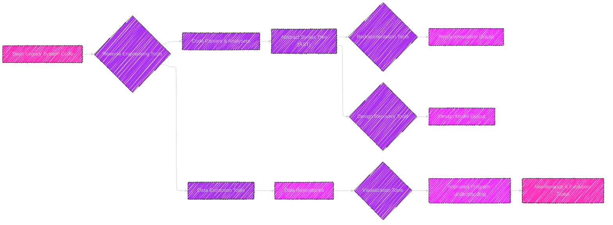
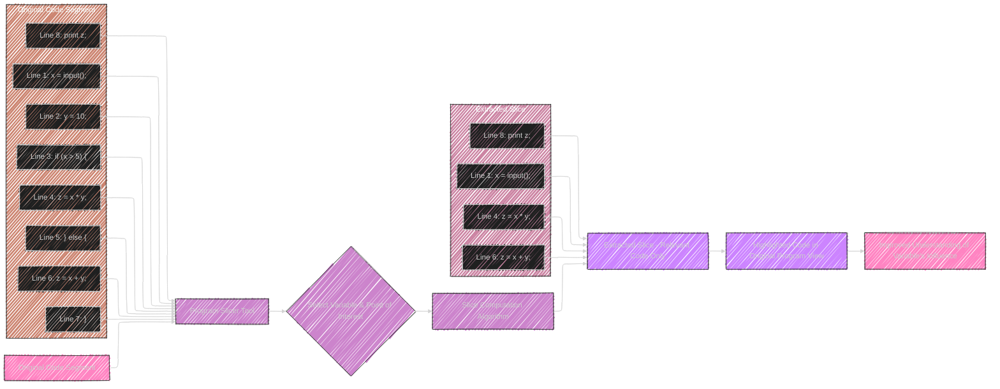

# Chapter 14: Maintenance Tools

## Diagram 1: Criteria for Selecting Tools - Mindmap

```mermaid
---
config:
  layout: elk
  look: handDrawn
  theme: dark
---
mindmap
  root((Chapter 14: Criteria for Selecting Tools))
    node(Capability)
      label(Supports required tasks)
      label(Technique works without tool first)
    node(Features)
      label(Essential functions offered)
      label(Rating feature importance)
    node(Cost and Benefits)
      label(Cost vs. Benefits Evaluation)
        label(Quality Improvement)
        label(Productivity Gains)
        label(Responsiveness)
        label(Cost Reduction)
        label(Overlap/Dichotomy Reduction)
    node(Platform)
      label(Hardware Platform)
      label(Software Environment)
      label(Compatibility)
    node(Programming Language)
      label(Supported Languages)
      label(Industry Standard Support)
      label(Paradigm Compatibility - e.g., OO)
    node(Ease of Use)
      label(User Friendliness)
      label(Learning Curve)
      label(Similarity to Familiar Tools)
    node(Openness of Architecture)
      label(Integration with Other Tools)
      label(Extensibility)
      label(Flexibility)
      label(Avoid Proprietary Lock-in)
    node(Stability of Vendor)
      label(Vendor Reputation)
      label(Longevity and Support)
      label(Company Background)
    node(Organizational Culture)
      label(Alignment with Work Patterns)
      label(User Acceptability)
      label(Cultural Fit)

```


This mindmap outlines the criteria for selecting maintenance tools as discussed in Chapter 14, including Capability, Features, Cost & Benefits, Platform, Programming Language, Ease of Use, Openness, Vendor Stability and Organisational Culture, providing a comprehensive overview for tool evaluation.

---

## Diagram 2: Taxonomy of Maintenance Tools

```mermaid
---
config:
  layout: elk
  look: handDrawn
  theme: dark
---
mindmap
  root((Chapter 14: Taxonomy of Maintenance Tools))
    node(Comprehension & Reverse Engineering Tools)
      label(Goal: Program Understanding)
      node(Program Slicer)
        label(Focus: Relevant Code Sections)
        label(Highlight Affected Code)
      node("Static Analyser <br> (Browser)")
        label(Focus: Program Text Examination)
        label(Code Browsing)
        label(Summaries of Program Elements)
      node("Dynamic Analyser <br> (Tracer)")
        label(Focus: Program Execution Behaviour)
        label(Execution Path Tracing)
        label(Dynamic System Characteristics)
      node(Data Flow Analyser)
        label(Focus: Data & Control Flow)
        label(Track Data & Control Paths)
        label(Ripple Effect Analysis)
      node(Cross-Referencer)
        label(Focus: Program Entity Usage)
        label(Index of Entity Usage)
        label(Declaration & Usage Tracking)
      node(Dependency Analyser)
        label(Focus: Inter-Entity Relationships)
        label(Dependency Database)
        label(Graphical Representation)
      node(Transformation Tool)
        label(Focus: Representation Conversion)
        label(Code to Visual & vice versa)
        label(Browsing & Editing Capabilities)
    node(Testing Tools)
      label(Goal: Support Testing Process)
      node(Simulator)
        label(Focus: Controlled Test Environment)
        label(Simulate System)
        label(Rich Tool Set)
      node(Test Case Generator)
        label(Focus: Test Data Creation)
        label(Automated Test Data Generation)
        label(Criteria-Based Generation)
      node(Test Paths Generator)
        label(Focus: Path Coverage)
        label(Identify Data & Control Flow Paths)
        label(Path Selection Criteria)
    node(Configuration Management Tools)
      label(Goal: Control Software Change)
      node("Version Control System <br> (e.g., SCCS)")
        label(Focus: Object Version Tracking)
        label(History Files)
        label(Version & Variant Management)
        label(Parallel Development Support)
      node(Build Tools)
        label(Focus: System Building & Rebuilding)
        label(Automated Build Process)
        label(Minimal Rebuilding)
      node(Environment Management)
        label(Focus: File System Control)
        label(Reproducible Environments)
        label(Object Sharing & Isolation)
    node(Other Task Support Tools)
      label(Documentation Tools)
        label(Hypertext Tools)
        label(Chart Generators)
        label(Requirements Tracers)
        label(CASE Tools)
      node(Complexity Assessment Tools)
        label(Complexity Quantifiers)
        label(Automated Complexity Measurement)
        label(e.g., McCabe's Cyclomatic, Halstead's)

```

This mindmap illustrates the taxonomy of maintenance tools, categorizing them by their primary function as discussed in Chapter 14. Categories include tools for Comprehension & Reverse Engineering, Testing, Configuration Management and Other Task Support, further detailing specific tool types and their features within each category.


---


## Diagram 3: Reverse Engineering Process with Tools




This flowchart illustrates a typical Reverse Engineering process, highlighting the role of various tools. It starts with Legacy System Code, moves through Reverse Engineering Tools like Parsers, Analysers, Data Extraction Tools, and Visualization Tools, showing the progression from code to improved understanding and finally to Maintenance & Evolution Tasks.

---

## Table: Tool Categories and Benefits

```mermaid
---
config:
    themeVariables:
      darkMode: true
---
table Diagram
    title Chapter 14: Tool Categories and Benefits
    header Tool Category | Primary Benefit | Key Functionality | Examples
    row Program Comprehension & Reverse Engineering Tools | Enhanced Understanding of Existing Systems | Code Analysis, Visualization, Abstraction | Program Slicers, Static Analysers, Dynamic Analysers, Cross-Referencers
    row Testing Tools | Improved Software Quality & Reliability | Automated Test Creation, Execution, and Analysis | Simulators, Test Case Generators, Test Paths Generators
    row Configuration Management Tools | Controlled Software Evolution & Change Management | Version Control, Build Management, Environment Management | SCCS, RCS, Build Automation Scripts
    row Documentation Tools | Improved Communication & Knowledge Sharing | Automated Documentation Generation, Hyperlinking, Requirements Tracing | Hypertext Tools, Chart Generators, CASE Tools
    row Complexity Assessment Tools | Quantitative Analysis of Code & System Complexity | Complexity Measurement, Metric Calculation, Code Quality Evaluation | McCabe's Cyclomatic Complexity Tools, Halstead's Measures Tools
    
```

This table provides a concise overview of the Tool Categories from Chapter 14, outlining the Primary Benefit of each category, its Key Functionality and Examples of tools within each category, facilitating a quick comparison of different tool types.


---

## Table: Comparison of Example Maintenance Tools

```mermaid
---
config:
    themeVariables:
      darkMode: true
---
table Tool Categories & Example Tools
    header Category | Tool | Description
    row Comprehension | Program Slicer | Extracts relevant code sections
    row Comprehension | Static Analyser | Examines code structure, metrics, etc.
    row Reverse Engineering  | Design Recovery Tool | Extracts design information from code
    row Testing | Test Case Generator | Automates test data creation
    row Testing | Simulator | Creates controlled testing environment
    row Configuration Management | SCCS/RCS/CVS | Version control systems
    row Configuration Management | Build Tools (e.g., Make) | Automate system building processes
    row Other | Documentation generators | Automate documentation creation
    row Other | Complexity Measurement Tools | Calculate code complexity metrics
```

This table provides a summary of example maintenance tools categorized according to the taxonomy in the chapter.  It lists examples from different categories such as Comprehension, Reverse Engineering, Testing, Configuration Management and other tasks, giving a quick comparative reference.


---

## Diagram 4: Example SCCS Workflow in Configuration Management


This flowchart represents a simplified example of a workflow using SCCS (Source Code Control System) for version control, illustrating the processes involved in adding a new file to SCCS, checking out a file for editing, making changes and then checking back in the updated version.

---


## Diagram 5: Benefits of Using Maintenance Tools


This mindmap visually represents the advantages of employing maintenance tools across different aspects of the maintenance process.  Benefits include increased productivity, improved quality, enhance control and management, cost reduction and support for best practices.

---

## Diagram 6: Example Output - Program Slicer




This flowchart illustrates the functionality of a Program Slicer tool. It shows an "Original Code Segment" being input into the "Program Slicer Tool". The user selects a variable and point of interest. The tool computes a "Slice" (Extract Slice), extracting only the relevant code which is then "Highlighted Code in Original Program View" leading to "Improved Understanding of Variable's Influence".  Example code segments are used to visually demonstrate input and output slices.

---

