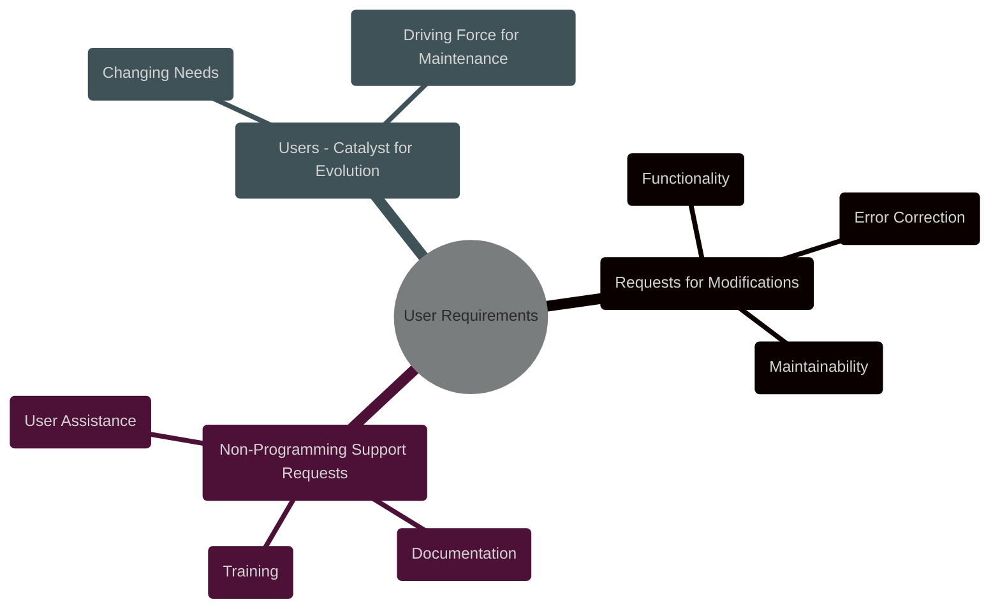
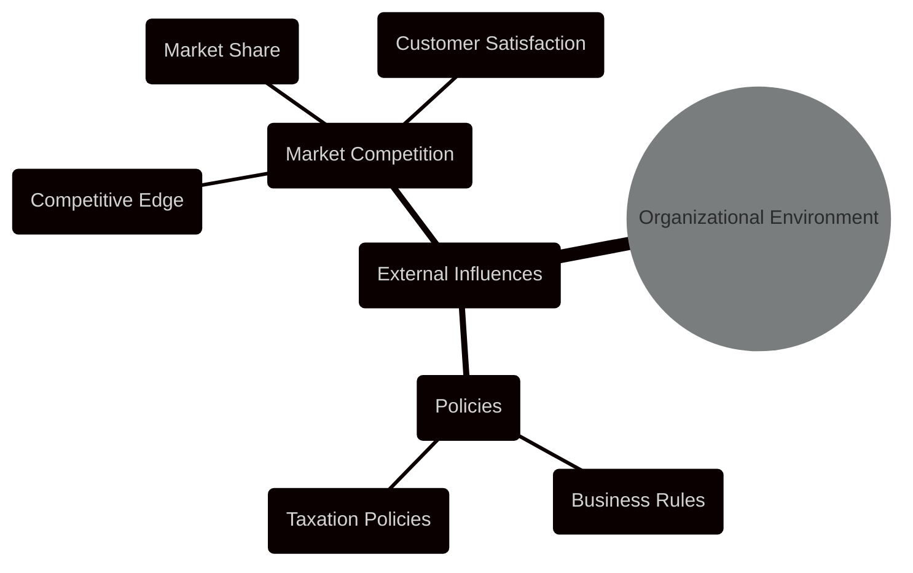
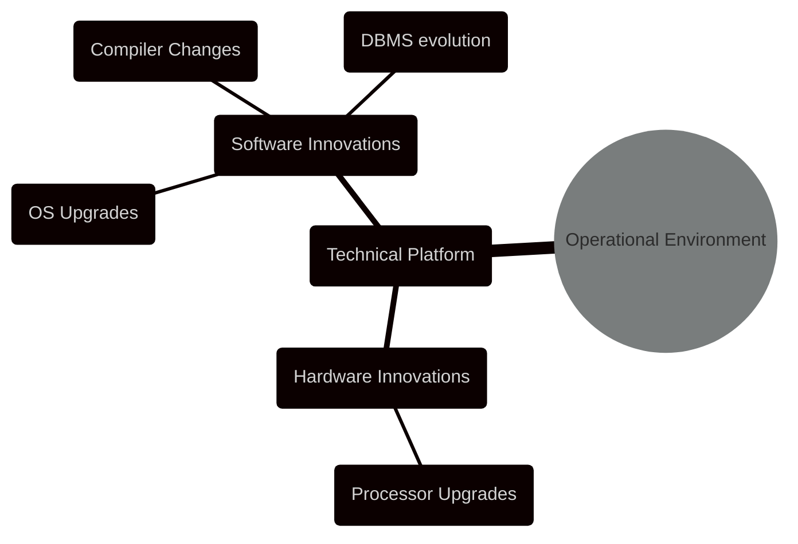
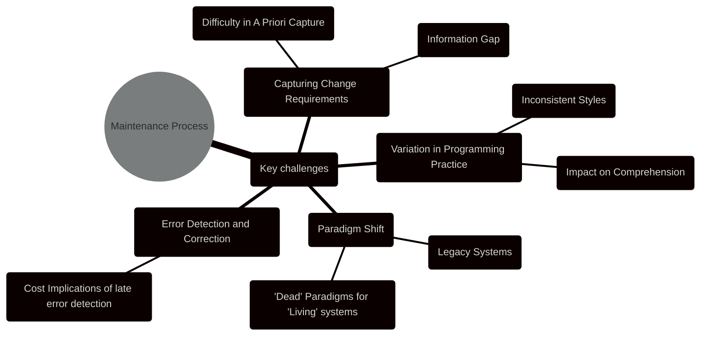
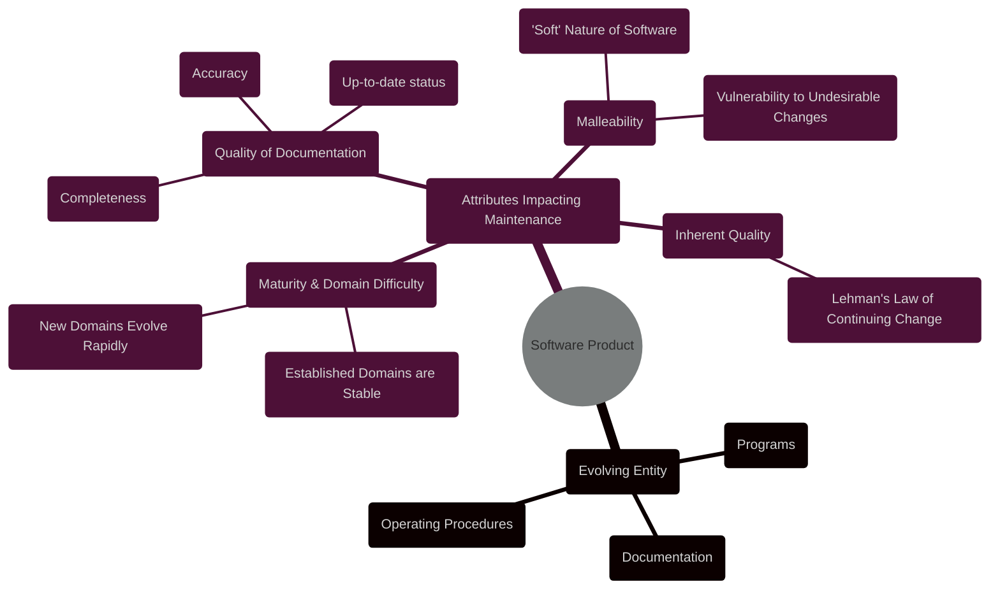
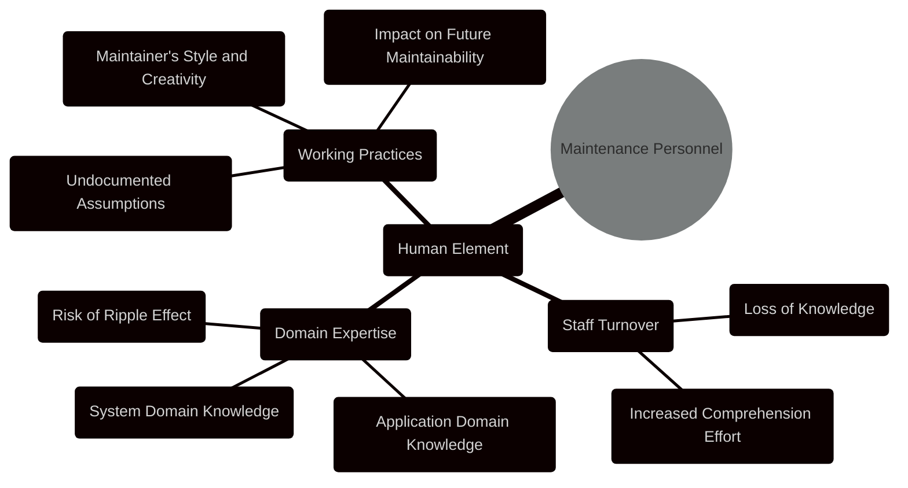

----

# Chapter 2 - The Maintenance Framework

## Diagram 1: Chapter Overview


```mermaid
---
config:
  layout: elk
  look: handDrawn
  theme: dark
---
mindmap
  root((Chapter 2: The Maintenance Framework))
    Information_and_Definitions
      node(Chapter Aim)
        label(Detail Context of Maintenance Activities)
      node(Key Question)
        label(Context for Maintenance Activities?)
      node(Key Definitions)
        label(Environment)
        label(Environmental Factor)
        label(Framework)
        label(Information Gap)
        label(Maintenance Challenge)
        label(Maintenance Personnel)
        label(Maintenance Process)
        label(Operating Environment)
        label(Organisational Environment)
        label(Safety-critical)
        label(Safety-related)
        label(Software Maintenance Framework)
    Software_Maintenance_Framework
      node("Software Maintenance Framework <br> (SMF)")
        label(Used to discuss factors contributing to maintenance challenge)
        label(Elements)
          node(User Requirements)
            label(Requests for Modifications)
              label(Functionality)
              label(Error Correction)
              label(Maintainability)
            label(Non-Programming Support Requests)
            label(Users - catalyst for evolution)
          node(Organisational Environment)
            label(External Influences)
              label(Policies)
              label(Market Competition)
              label(Business Rules)
              label(Taxation Policies)
              label(Competition for Market Share)
          node(Operational Environment)
            label(Technical Platform)
              label(Hardware Innovations)
              label(Software Innovations)
              label(OS Upgrades)
              label(Compiler Changes)
              label(Database Management Systems)
          node(Maintenance Process)
            label(Activities & Actions during Maintenance)
              label(Capturing Change Requirements)
                label(Difficulty in A Priori Capture)
                label(Information Gap)
              label(Variation in Programming Practice)
                label(Inconsistency in styles)
                label(Impact on comprehension)
              label(Paradigm Shift)
                label(Legacy Systems)
                label('Dead' Paradigms for 'Living' systems)
              label(Error Detection and Correction)
                label(Cost implications of late error detection)
          node(Software Product)
            label(Evolving Programs, Documentation & Procedures)
              label(Maturity & Difficulty of Application Domain)
                label(Established vs. Nascent Domains)
              label(Quality of Documentation)
                label(Often Lacking or Outdated)
              label(Malleability of Programs)
                label('Soft' nature, Vulnerability to change)
              label(Inherent Quality)
                label(Lehman's Law of Continuing Change)
          node(Maintenance Personnel)
            label(Human Element in Maintenance)
              label(Staff Turnover)
                label(Loss of original authors, tacit knowledge)
                label(Impact on comprehension effort)
              label(Domain Expertise)
                label(Lack of system & application domain knowledge)
                label(Ripple Effect Risks)
              label(Working Practices)
                label(Maintainer's style & creativity)
                label(Undocumented assumptions & decisions)
    Relations_Between_Factors
      node(Relations Between Maintenance Factors)
        label(Interactions drive software evolution & maintenance challenges)
        node(Product-Environment Relation)
          label(Product hosted by environments)
          label(Inherits environment changes - Brooks Quote)
        node(Product-User Relation)
          label(Product serves user needs)
          label(Changing User Needs drive evolution)
        node(Personnel-Product Interaction)
          label(Personnel as change conduit)
          label(Personnel quality & process affects change quality)
          label(Impact on product attributes Size & Complexity)

%%style root fill:#fbc,stroke:#333,stroke-width:1px

```

This mindmap focuses solely on Chapter 2. It's structured to reflect the chapter's flow:

*   **Information and Definitions:** This branch covers the chapter's aim, the central question it addresses, and lists all the key definitions provided in Chapter 2. This gives a quick reference to the vocabulary of the chapter.
*   **Software Maintenance Framework (SMF):** This is the central and most detailed branch, representing the core concept of the chapter. It breaks down the SMF into its six key components: User Requirements, Organisational Environment, Operational Environment, Maintenance Process, Software Product, and Maintenance Personnel. Each component is further detailed with its sub-elements and important aspects as described in the chapter.
*   **Relations Between Factors:** This branch summarizes the crucial inter-relationships between the components of the SMF, specifically Product-Environment, Product-User and Personnel-Product relations and their impact, emphasizing how these relationships are the driving forces behind software evolution and maintenance challenges.

This detailed mindmap should provide a comprehensive visual representation of all the key concepts and their interconnections within Chapter 2, "The Maintenance Framework".  It can be used for quick review, understanding the chapter's structure and grasping the details of the Software Maintenance Framework.

---


This expanded set of diagrams below provides a more comprehensive and detailed visual representation of Chapter 2, "The Maintenance Framework," catering to different learning styles and information needs.  The relationship diagram contextualizes the framework, the component mindmaps provide granular details, and the definition table offers quick vocabulary reference. Let me know if you'd like any further modifications!


----


**Diagram 1: Chapter 2 - Relations Between Maintenance Factors - Flowchart**

```mermaid
graph LR
    subgraph User_Environment [User Environment]
    style User_Environment fill:#ccf,stroke:#333,stroke-width:1px
        UE[User]
    end
    subgraph Organizational_Environment [Organizational Environment]
    style Organizational_Environment fill:#aac,stroke:#333,stroke-width:1px
        OE[Org Env]
    end
    subgraph Operational_Environment [Operational Environment]
    style Operational_Environment fill:#cca,stroke:#333,stroke-width:1px
        OpE[Oper Env]
    end
    subgraph Maintenance_Process [Maintenance Process]
    style Maintenance_Process fill:#aea,stroke:#333,stroke-width:1px
        MP[Maint. Process]
    end
    subgraph Maintenance_Personnel [Maintenance Personnel]
    style Maintenance_Personnel fill:#eaa,stroke:#333,stroke-width:1px
        MPe[Personnel]
    end
    subgraph Software_Product [Software Product]
    style Software_Product fill:#faa,stroke:#333,stroke-width:1px
        SP[Product]
    end

    SP --> UE
    SP --> OE
    SP --> OpE
    SP --> MPe

    MPe --> SP

    OE -- Indirect Influence --> MP
    UE -- Indirect Influence --> MP
    OpE -- Indirect Influence --> MP
    OE -- Indirect Influence --> MPe
    UE -- Indirect Influence --> MPe
    OpE -- Indirect Influence --> MPe

    linkStyle 0,1,2,3,4,5,6,7,8,9,10,11 stroke-width:2px,stroke:black;
    linkStyle 6,7,8,9,10,11  stroke-dasharray: 5 5;
```

**Diagram 1: Chapter 2 - Relations Between Maintenance Factors - Flowchart**

This flowchart illustrates the "Relations Between Maintenance Factors" section of Chapter 2 in more detail:

*   **Nodes as Components:** Each of the six components of the Software Maintenance Framework (User Environment, Organizational Environment, Operational Environment, Maintenance Process, Maintenance Personnel and Software Product) is represented as a subgraph node for visual grouping.
*   **Arrows as Relations:** Arrows indicate the relationships and influences between the components:
    *   **Solid Arrows:** Represent direct influences, showing the Product being directly influenced by User Env, Org Env, Oper Env and Maintenance Personnel via links `SP --> UE`, `SP --> OE`, `SP --> OpE`, `SP --> MPe`. Also the Personnel influence the product via link `MPe --> SP`.
    *   **Dashed Arrows:** Represent indirect influences, with the Maintenance Process and Personnel being indirectly influenced by all three Environments via links `OE -- Indirect Influence --> MP`, `UE -- Indirect Influence --> MP`, `OpE -- Indirect Influence --> MP`, `OE -- Indirect Influence --> MPe`, `UE -- Indirect Influence --> MPe`, `OpE -- Indirect Influence --> MPe`.
*   **Visual Distinction:** Direct influences are shown with solid lines (`linkStyle 0,1,2,3,4,5`), indirect influences with dashed lines (`linkStyle 6,7,8,9,10,11  stroke-dasharray: 5 5;`),  making it easy to differentiate. Each subgraph styled with different background color for visual separation.

This diagram clearly visualizes the interdependencies and influences within the Maintenance Framework, making the abstract "relations" tangible and understandable.

---

## Diagram 2: Software Maintenance Framework Components - Mindmap Breakdown

To further detail each component of the SMF, instead of a single large mindmap, let's create individual, focused mindmaps for each component to illustrate their sub-elements more clearly:

**a) User Requirements:**



**b) Organizational Environment:**



**c) Operational Environment:**



**d) Maintenance Process:**



**e) Software Product:**



**f) Maintenance Personnel:**




These six smaller mindmaps break down each of the components of the SMF into their sub-elements, providing a more granular view than the single overview mindmap. This modular approach can enhance understanding by focusing on each aspect individually.

---

## Diagram 3: Key Definitions

```mermaid
---
config:
    themeVariables:
      darkMode: true
---
table Diagram
    title Chapter 2: Key Definitions
    header Term | Definition
    row Environment | Totality of conditions & influences acting externally upon an entity.
    row Environmental Factor | Agent acting externally, influencing an entity's form or operation.
    row Framework | Set of ideas, conditions, assumptions guiding approach, perception, understanding.
    row Information Gap | Discrepancy in knowledge between users & maintainers needed for change requests.
    row Maintenance Challenge | Need to keep systems running; complex for software due to non-physical degradation.
    row Maintenance Personnel | Individuals involved in maintaining software.
    row Maintenance Process | Activities/actions by personnel/machine during software maintenance.
    row Operating Environment | Software & hardware influencing a software product.
    row Organisational Environment | Non-software/hardware environmental factors (policies, competition).
    row Safety-critical | System failure could cause death, injury, major loss, damage.
    row Safety-related | System failure increases risk of injury or damage.
    row Software Maintenance Framework | Context & environment for software maintenance activities.
    
```


Finally, a table to list out all the definitions from Chapter 2 for quick reference.  This offers a more structured way to review the vocabulary introduced in the chapter compared to simply listing them in the mindmap.

---

