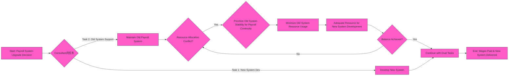
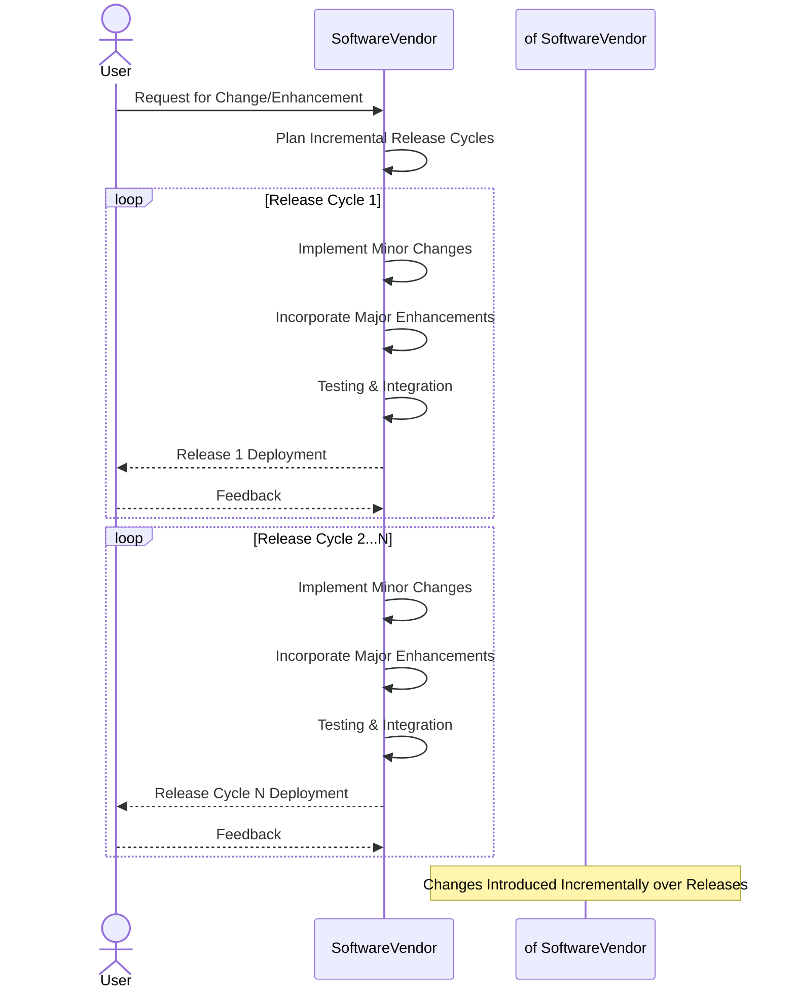
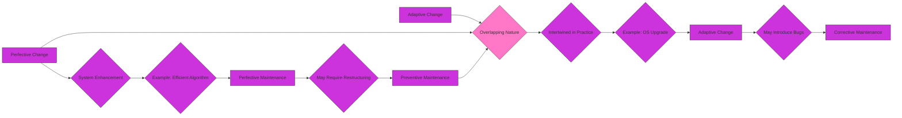

# Chapter 3

## Diagram 1: Fundamentals of Software Change - Mindmap Overview

```mermaid
---
config:
  layout: elk
  look: handDrawn
  theme: dark
---
mindmap
  root((Chapter 3: <br> Fundamentals of Software Change))
    node(Overview)
      label(Detail of Software Change)
      label(Types & Categorization)
      label(Fundamental Theory)
      label(Lehman's Laws)
    node(Discussion Points)
      label(Stimulate thinking on key issues:)
        label("Types of Change")
        label("Categorization")
        label("Prioritization")

    node(3.1 Introduction)
      label(Chapter's Focus: Detail of Software Change)
      label(Types & Categorization Explored)
      label(Fundamental Theory Introduction)

    node(3.2 Definitions)
      label(Key Terms Defined:)
        label("Adaptive Change")
        label("Change")
        label("Corrective Change")
        label("E-type System")
        label("Ongoing Support")
        label("Perfective Change")
        label("Post-delivery Evolution")
        label("Preventive Change")
        label("Ripple Effect")
        label("S-type System")
        label("Software Evolution")

    node(3.3 Software Change)
      node(3.3.1 Classification of Changes)
        node(Corrective Change)
          label(Defect-initiated Modification)
          label(Design Errors)
          label(Logic Errors)
          label(Coding Errors)
          label(Residual Errors/Bugs)
          label("Emergency Fixes ('Patching')")
            label(Increased Complexity)
            label(Ripple Effects)
        node(Adaptive Change)
          label(Environment-Driven Modification)
          label(Changing Software System)
          label(Changing Hardware Platform)
          label(Example: OS Upgrade)
          label(Euro Introduction - Example)
        node(Perfective Change)
          label(Requirement Expansion)
          label(System Enhancement)
          label(Functionality Expansion)
          label(Efficiency Improvement)
          label("Module Addition (S to S')")
          label(Redundant Functionality Removal)
        node(Preventive Change)
          label(Prevent Malfunctions / Improve Maintainability)
          label(Initiated Internally)
          label(No Baseline Functionality Increase)
          label(Examples:)
            label("Code Restructuring")
            label("Code Optimization")
            label("Documentation Update")
      node(3.3.2 Importance of Categorizing Changes)
        label(Intertwined Nature of Changes in Practice)
        label(Rationale:)
          label("Different Response Times Needed")
          label("Effective Prioritization of Requests")
      node(3.3.3 Case Study - Obsolete System)
        label(ACME Health Clinic Payroll System)
        label(1960s System - Salary Limit Issue)
        label(Consultant Tasks)
          label("New System Development")
          label("Maintain Old System (Payroll Continuity)")
        label(Balancing Priorities)
        label("Keeping Old System Running")
        label("Developing New System")
      node(3.3.4 Incremental Release)
        label(Changes not always all at once)
        label(Incremental Implementation)
        label(Minor Changes - Ongoing Operation)
        label(Major Enhancements - New Release)
        label(Bespoke vs. Off-the-Shelf Change Mechanisms)

    node(3.4 Ongoing Support)
      label(Non-Programming Related Work)
      label(Essential for Change Communication)
      label(Objectives:)
        label("Effective Communication")
        label("Training of End-Users")
          label("Manuals & Help Systems")
          label("On-site Visits")
          label("Formal/Informal Courses")
          label("User Groups (Peer Training)")
        label("Providing Business Information")
          label("Cost Estimates")
          label("Strategic Decisions Support")
          label("System Replacement Analysis")

    node(3.5 Lehman's Laws)
      label(Software in Real World Domains)
      label(Theory of Software Evolution)
      node(Law I: Continuing Change)
        label("Systems must adapt or become unsatisfactory")
        label("Evolution like Biological Organisms")
        label("Variance between system and context drives change")
      node(Law II: Increasing Complexity)
        label("Complexity increases unless actively reduced")
        label("Structure Maintenance vs. Change Focus Trade-off")
        label("Inevitably slows system growth rate")
      node(Law III: Self-Regulation)
        label("Evolutionary Processes show Statistical Regularity")
        label("E-type software in wider organizational context")
        label("Organizational goals and constraints drive evolution")
        label("Feedback controls evolution")
      node(Law IV: Conservation of Organizational Stability)
        label("Average work rate in E-type process is constant")
        label("Counter-intuitive, not management driven alone")
        label("Many inputs lead to constant work rate")
      node(Law V: Conservation of Familiarity)
        label("Average incremental growth tends to remain constant/decline")
        label("More changes = harder understanding")
        label("Impacts change quality & progress")
      node(Law VI: Continuing Growth)
        label("Functional capability must continually increase")
        label("Maintains User Satisfaction")
        label("Feedback from users drives E-type system growth")
      node(Law VII: Declining Quality)
        label("Quality declines unless rigorously adapted to changing environment")
        label("System assumptions become invalidated")
        label("Quality decline relative to newer products with updated assumptions")
      node(Law VIII: Feedback Systems)
        label("Evolution is multi-level, multi-loop, multi-agent feedback system")
        label("Feedback is key in all laws")
        label("Process dominated by Feedback")
      node(Laws as Laws?)
        label("Criticized as Observation/Hypotheses")
        label("Lehman admits 'Intuition' in using 'Law'")
        label("Intuition proven sound over time")

    node(3.6 Summary)
      label(Key Points Recap:)
        label("Maintenance Types: Corrective, Adaptive, Perfective, Preventive, Ongoing Support")
        label("Real World Domain Focus")
        label("Lehman's Laws - Core principles")
      label(Next Chapter: Realities & Costs)
  

```


This mindmap provides a structural overview of Chapter 3, breaking down each section and subsection into its core topics for easy navigation and understanding of the chapter's flow.

---

## Diagram 2: Chapter 3.3.1 Classification of Changes

```mermaid
---
config:
  layout: elk
  look: handDrawn
  theme: dark
---
mindmap
  root(("Chapter 3.3.1: <br> Classification of Software Changes"))
    node(Corrective Change)
      label("Defect-Driven")
      label("Purpose: <br> Fault Correction")
      label(Types of Defects)
        label("Design Errors")
        label("Logic Errors")
        label("Coding Errors")
      label(Action upon Failure)
        label("Emergency Fixes <br> ('Patching')")
        label("Problems with Patching")
          label("Increased Complexity")
          label("Ripple Effects")
        label("Spaghetti Syndrome / Software Fatigue")
    node(Adaptive Change)
      label("Environment-Driven")
      label("Purpose: <br> Environment Accommodation")
      label(Environment Factors)
        label("Operating Environment")
          label("Hardware Innovations")
          label("Software Innovations")
        label("Organizational Environment")
          label("Policy Changes")
          label("Market Competition")
      label("Example: <br> VAT Rule Changes")
    node(Perfective Change)
      label("Requirement-Driven Expansion")
      label("Purpose: <br> Enhancing Existing System")
      label(Types of Enhancement)
        label("Functionality Enhancement")
        label("Efficiency Improvement")
      label("System Evolution <br> (S to S')")
      label(Functionality Redundancy Handling)
        label("Removal of Redundant Modules")
    node(Preventive Change)
      label("Maintainability-Driven")
      label("Purpose: <br> Prevent Malfunctions & Improve Maintainability")
      label("Initiated Internally - Maintenance Org")
      label(No Baseline Functionality Increase)
      label("Focus: <br> Ease of Understanding & Future Maintenance")
      label(Examples)
        label("Code Restructuring")
        label("Code Optimization")
        label("Documentation Update")

```

This mindmap focuses specifically on the four classifications of software change discussed in section 3.3.1: Corrective, Adaptive, Perfective, and Preventive.  For each classification, it outlines the key characteristics, purpose and examples.

---

## Diagram 3: Chapter 3.5 Lehman's Laws

```mermaid
---
config:
  layout: elk
  look: handDrawn
  theme: dark
---
mindmap
  root(("Chapter 3.5: <br> Lehman's Laws of Software Evolution"))
    node("Law I: <br> Continuing Change")
      label("Systems must adapt or degrade")
      label("Evolution is unavoidable")
    node("Law II: <br> Increasing Complexity")
      label("Complexity grows with evolution")
      label("Requires effort to combat")
    node("Law III: <br> Self-Regulation")
      label("Evolution processes are statistically regular")
      label("Organizational context influences evolution")
    node("Law IV: <br> Conservation of Organizational Stability")
      label("Average work rate is constant over time")
      label("Effort is self-regulating")
    node("Law V: <br> Conservation of Familiarity")
      label("Incremental growth tends to decline/constant")
      label("Familiarity decreases with changes")
    node("Law VI: <br> Continuing Growth")
      label("Functional Capability must increase continuously")
      label("Maintains User Satisfaction")
    node("Law VII: <br> Declining Quality")
      label("Quality declines without adaptation")
      label("Environmental changes impact quality")
    node("Law VIII: <br> Feedback Systems")
      label("Evolution is multi-level feedback system")
      label("Feedback is central")
    node(Nature of Laws)
      label("Observations, not strict 'Laws'")
      label("Empirically Supported & Intuitive")

```

This mindmap details each of Lehman's Laws of Software Evolution, providing a concise summary of each law's principle.


----


## Diagram 4: Chapter 3.3.1 Classification of Software Changes

**Classification of Software Changes - Comparison Table**


```mermaid
---
config:
    themeVariables:
    darkMode: true
---
table Diagram
    title Chapter 3.3.1: Comparison of Software Change Classifications
    header Category | Trigger | Primary Purpose | Examples | Focus 
    row **Corrective Change** | Defects, Errors, Bugs | Fault Removal, System Restoration | Bug Fixes, Error Handling, Patching | Reliability, Stability
    row **Adaptive Change** | Environmental Modifications (HW/SW/Policy) | Environment Accommodation, External Alignment | OS Upgrades, New Regulations Compliance, Platform Migration | Adaptability, External Factors
    row **Perfective Change** | User Requests, Evolving Needs | System Enhancement, Improved Functionality & Efficiency | New Features, Performance Tuning, Usability Improvements | Enhancement, User Satisfaction
    row **Preventive Change** | Internal Degradation, Maintainability Concerns | Prevent Malfunctions, Improve Future Maintenance | Code Restructuring, Documentation Updates, Code Optimization | Long-Term Maintainability, Code Quality

```


This table provides a concise comparison of the four Software Change Classifications along key dimensions: Trigger, Primary Purpose, Examples and Focus.

---

## Diagram 5: Chapter 3.3.3 Case Study - ACME Payroll - Flowchart of Decision Balancing




This flowchart visualizes the decision-making process in the ACME Health Clinic Payroll System case study, illustrating the need to balance resources between maintaining the obsolete system and developing the new one.

---

## Diagram 6: Chapter 3.3.4 Incremental Release - Sequence Diagram




This sequence diagram depicts the process of incremental software release, showing how changes, both minor and major, are incorporated and deployed over successive releases.

---

## Diagram 7: Chapter 3.4 Ongoing Support

```mermaid
---
config:
  layout: elk
  look: handDrawn
  theme: dark
---
mindmap
  root(("Chapter 3.4: <br> Ongoing Support"))
    node(Objectives of Ongoing Support)
      node(Effective Communication)
        label("Between Maintenance & End-Users")
        label("Build Rapport & Cooperation")
        label("Understand Business Needs")
        label("Increase User Involvement")
      node(Training of End-Users)
        node(Methods)
          label("Manuals & Documentation")
          label("Online Help & FAQs")
          label("On-site Support")
          label("Formal Courses")
        node(User Groups)
          label("Peer-to-Peer Learning")
          label("Shared Experiences")
      node(Providing Business Information)
        label("Timely & Accurate Data")
        label("Strategic Decision Support")
        label("Examples")
          label("Cost of Enhancements")
          label("System Replacement Analysis")
    node(Nature of Ongoing Support)
      label(Service-Oriented, Non-Programming)
      label("Supports Change Communication & User Satisfaction")
      label("Essential for Successful Change Implementation")

```

This mindmap breaks down the concept of Ongoing Support, detailing its objectives - Effective Communication, Training of End-Users, and Providing Business Information - and the various elements within each objective.

---

## Diagram 8: Chapter 3.3.2 Relationship Between Software Changes



**Chapter 3.3.2 Relationship Between Software Changes - Flowchart**

This flowchart illustrates the potential inter-relationships between different types of software changes, as described in section 3.3.2. It shows how Adaptive, Perfective and Corrective Changes can be linked and lead to other types of maintenance activities.


-----
