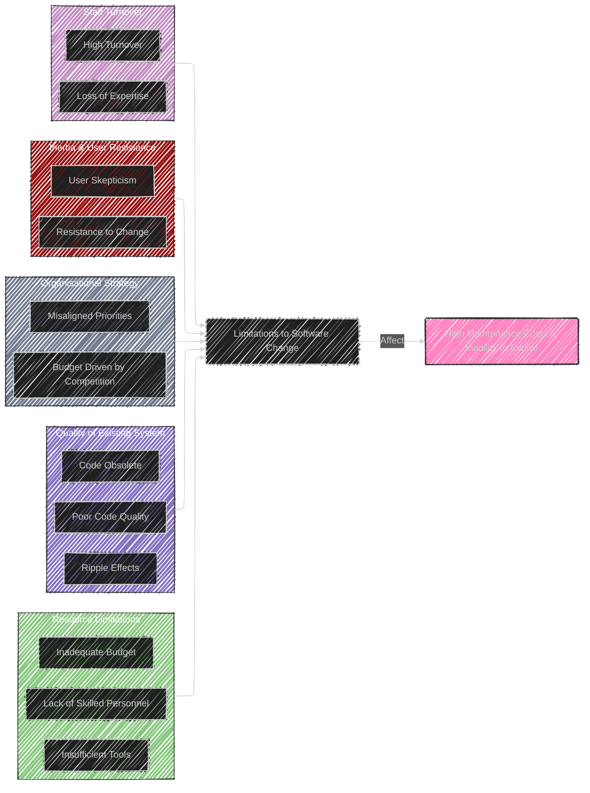

----

# Chapter 4: Limitations and Economic Implications to Software Change


## Diagram 1: Limitations and Economic Implications

```mermaid
---
config:
  layout: elk
  look: handDrawn
  theme: dark
---
mindmap
  root((Chapter 4: <br> Limitations & Economic Implications))
    node(Introduction)
      label(High cost of modifying software)
      label(Obsolete systems & new technologies)
      label(Balancing cost, reliability, timeliness)
    node(Definitions)
      label(Image)
      label(Maintenance Crisis)
      label(Nomenclature)
    node(Economic Implications of Modifying Software)
      label("High expenditure on maintenance (40-70%)")
      label(Maintenance vs New Development Costs)
      label(Expenditure on Different Changes:)
        label("Corrective (20%)")
        label("Adaptive (25%)")
        label("Perfective (50%)")
        label("Preventive (5%)")
      label("Cost Estimation Models (e.g. COCOMO)")
    node(Limitations to Software Change)
      node(Resource Limitations)
        label(Skilled Programmers)
        label(Tools and Environment)
        label(Budget Allocation)
      node(Quality of Existing System)
        label(Poor Quality Code)
        label(Unpredictable Ripple Effects)
        label(Change becomes impossible)
      node(Organisational Strategy)
        label(Competition Driven Budgets)
        label(Strategic Decisions > Objective Analysis)
      node(Inertia)
        label(User Resistance to Change)
        label(Skepticism from Past Experiences)
      node(Attracting & Retaining Staff)
        label(Image Problem)
        label(High Turnover)
        label(Impacts Costs & Quality)
    node(Nomenclature & Image Problems)
      label("'Maintenance' - a Misnomer?")
      label(Evolution vs. Deterioration)
      label(Negative Image of Maintenance)
      label(Lack of Consensus on Terminology)
      label(Impacts Status and Skills Recognition)
    node(Potential Solutions to Maintenance Problems)
      node(Budget & Effort Reallocation)
        label(Invest in Maintainability Early)
        label(Improved Specification & Design)
        label(Quality Assurance)
      node(Complete System Replacement)
        label(High Risks & Costs)
        label(Economic Constraints)
        label(Residual Errors in New Systems)
        label(Loss of Embedded Knowledge & Data)
      node(Maintenance of Existing System)
        label(Viable Alternative)
        label(Potential for Evolution Remains)
        label(Techniques, Tools, Management Practices Needed)
    node(Summary)
      label(High Maintenance Expenditure Causes)
      label(Solutions Summary)
        label("Budget Reallocation (Long-term)")
        label("System Replacement (Sometimes Necessary)")
        label("Improve Existing Systems (Most Viable)")

```


This mindmap provides a comprehensive overview of Chapter 4, structured around its main sections: Economic Implications, Limitations, Image Problems, and Potential Solutions. It further breaks down each section into key points and sub-topics for a clear visual representation of the chapter's content.

---

## Table 1: Expenditure on Different Changes

```mermaid
---
config:
    themeVariables:
      darkMode: true
---
table Diagram
    title Expenditure on Different Changes (Lientz & Swanson Study)
    header Change Type | Percentage of Maintenance Effort
    row Corrective | 20%
    row Adaptive | 25%
    row Perfective | 50%
    row Preventive | 5%
    
```


This table presents the data from the Lientz and Swanson study mentioned in Chapter 4, showing the typical distribution of effort across different types of software maintenance changes.

----


## Diagram 2: Limitations to Software Change




This Fishbone diagram (also known as Ishikawa or Cause-and-Effect diagram) visually represents the various limitations to software change as "causes" that contribute to the "effect" of high maintenance costs and the inability of software to evolve effectively. The main categories of limitations (Resource, System Quality, Organisational Strategy, User Inertia and Staff Retention) are clearly branched out.

---

## Table 2: Nomenclature and Image

```mermaid
---
config:
    themeVariables:
      darkMode: true
---
table Diagram
    title "Nomenclature & Image - Term Comparison"
    header Term | Pros | Cons | Image Connotations
    row "Maintenance" | - Widely Understood Term  - Familiar in Industry | - Misleading (implies 'fixing' only)  - Negative Connotations (Low Status) | -Unexciting -Low Status -Dull
    row "Evolution" | - Captures Dynamic Nature of Software - Positive Connotations  | - Less Familiar in Common Usage - May Seem Too Abstract | -Dynamic -Forward-Moving -Progressive
    row "Support" | - Customer-Centric View  - Emphasizes User Assistance | - Too Broad (includes non-programming tasks) - Less Specific to Technical Work | -Caring -Helpful -Service-Oriented
    
```

**Table 2: Nomenclature and Image - Pros & Cons Table**

This table compares the terms "Maintenance," "Evolution," and "Support" in terms of their pros, cons, and image connotations. This helps to illustrate the "Nomenclature and Image Problems" discussed in Chapter 4, by showing why "Maintenance" might be considered a problematic term despite its common usage.

---

## Table 3: Potential Solutions

```mermaid
---
config:
    themeVariables:
      darkMode: true
---
table Diagram
    title Potential Solutions - Pros & Cons
    header Solution | Pros | Cons
    row "Budget & Effort Reallocation" | - Proactive Approach - Focus on Prevention - Aims for Long-Term Maintainability | - Requires Upfront Investment - Benefits Not Immediately Visible - May Be Difficult to Justify Short-Term
    row "Complete System Replacement" | - Opportunity for Modernization - Addresses Deep-Rooted Issues | - Extremely Expensive & Risky - High Probability of Failure - Loss of Embedded Knowledge & Data - May Not Be Economically Viable
    row "Maintenance of Existing System (Improvement Focused)" | - Most Pragmatic & Cost-Effective (Short-Term) - Leverages Existing Investment - Allows Incremental Evolution | - May Not Address Fundamental Issues - Risk of Increasing Technical Debt - Can Become Unsustainable Long-Term
    
```

**Table 3: Potential Solutions - Pros & Cons Table**

This table lists the potential solutions to maintenance problems discussed in Chapter 4 (Budget & Effort Reallocation, Complete System Replacement, and Maintenance of Existing System) and compares them based on their pros and cons. This structured comparison clarifies the trade-offs and implications of each approach.

---

## Diagram 4: Expenditure on Change Types

```mermaid
---
config:
  themeVariables:
    darkMode: true
---
barchart-beta
    title Expenditure on Different Change Types (Lientz & Swanson Study)
    x-axis Change Type
    y-axis Percentage of Effort
    bar Corrective : 20
    bar Adaptive : 25
    bar Perfective : 50
    bar Preventive : 5

```

**Diagram 4: Expenditure on Change Types - Bar Chart**

Building on the previous table, this bar chart visually represents the distribution of maintenance effort across different change types (Corrective, Adaptive, Perfective, Preventive) from the Lientz & Swanson study. The bar chart emphasizes the significantly larger portion of effort spent on Perfective maintenance visually.

---

## Diagram 5: Image Problem


**Diagram 5: Image Problem - Stairway Diagram**

This Stairway diagram symbolically represents the image problem associated with software maintenance careers. "Software Development" is placed at the top of the stairway, representing the more desired and prestigious career path, while "Software Maintenance" is at the bottom, illustrating its perceived lower status within the industry, with Software Engineering in the middle as a more neutrally perceived field.


----
