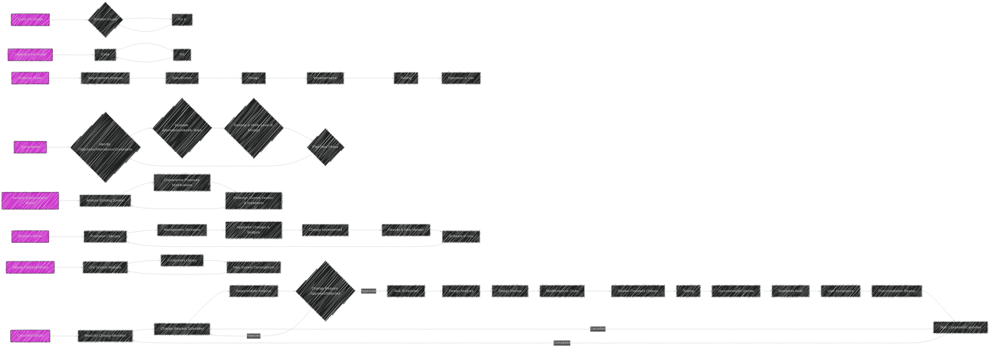
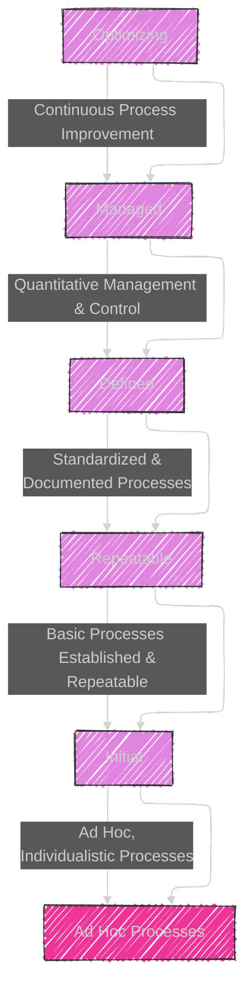
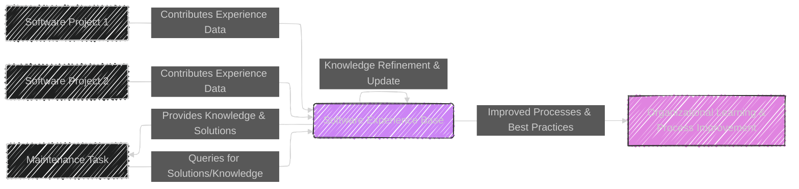

# Chapter 5

## Diagram 1: The Maintenance Process - Mindmap Overview

```mermaid
---
config:
  layout: elk
  look: handDrawn
  theme: dark
---
mindmap
  root(("Chapter 5: <br> The Maintenance Process"))
    node(Introduction)
      label(Importance of Process Models)
      label(Context of Traditional Life-Cycle Models)
      label(Need for Maintenance-Conscious Models)
    node(Software Production Process)
      label(Stages: <br> Idea to Use to Evolution)
      label(Process vs. Life-Cycle)
      label(Model as Abstraction)
    node(Critical Appraisal of Traditional Models)
      node(Code-and-Fix Model)
        label(Ad Hoc, Simple, Fast Fixes)
        label(Lack of Structure & Planning)
      node(Waterfall Model)
        label(Sequential Phases)
        label(Document Driven)
        label(Limited Feedback Loops)
        label(Fails to capture Evolutionary nature)
      node(Spiral Model)
        label(Cyclical Phases, Risk Driven)
        label(Flexible, Accommodates other Models)
        label(Risk Assessment Focus)
    node(Maintenance Process Models)
      label(Need for Maintenance-Specific Models)
      node(Quick-Fix Model)
        label(Ad Hoc, Firefighting)
        label(Speed over Structure)
        label(Short-Term Fix Focus)
      node(Boehm's Model)
        label(Economic Driven)
        label(Management Decisions Central)
        label(Cost-Benefit Evaluations)
      node(Osborne's Model)
        label(Reality-Based)
        label(Iterative Loops)
        label(Addresses Inadequate Documentation)
      node(Iterative Enhancement Model)
        label(Enhancement Driven)
        label(Iterative Cycles)
        label(Assumes Documentation)
      node(Reuse-Oriented Model)
        label(Reuse Centric)
        label(Component Library Focus)
        label(Reuse from Any Life-Cycle Phase)
    node(When to Make a Change)
      label(Decision Making Process)
      label(Change Control Considerations)
    node(Process Maturity)
      label("Capability Maturity Model (CMM)")
        label(Levels: Initial to Optimizing)
      label(Software Experience Bases)
        label(Knowledge Sharing & Improvement)
    node(Summary)
      label(Key points of the chapter)
      label(Transition to next part of book)


```


This mindmap provides an overview of Chapter 5, outlining the progression from traditional process models to maintenance-specific models, and highlighting key concepts like process maturity and decision-making in change implementation.

---

## Diagram 2: Maintenance Process Models




**Diagram 2: Chapter 5 - Maintenance Process Models - Flowchart (Redux)**

This is the same Flowchart as Diagram 3 from the previous response, but included again here for completeness as it is central to Chapter 5.

---

## Table 1: Process Model Comparison

```mermaid
---
config:
    themeVariables:
      darkMode: true
---
table Diagram
    title Chapter 5: Process Model Comparison
    header Model | Strengths | Weaknesses | Best Use Cases
    row Quick-Fix | Fast implementation for urgent issues | No long-term planning, Poor structure | Very small, isolated fixes, emergencies
    row Code-and-Fix | Simple, iterative coding and correction |  Unstructured, Unmaintainable Long-term | Small, personal projects
    row Waterfall | Structured, Phase-based, Documented | Inflexible to change, Limited feedback | Well-defined, stable requirements, large projects
    row Spiral | Risk-Driven, Flexible, Adaptive | Complex risk assessment, Audit challenges | High-risk, evolving projects, accommodating other models
    row Boehm's | Economic Focus, Managerial Control, Cost-Benefit Analysis | Can be rigid, Management heavy | Budget-conscious projects, prioritizing economic factors
    row Osborne's | Real-World Focus, Iterative, Pragmatic | Complex, potentially less structured  | Real-world maintenance with existing constraints
    row Iterative Enhancement | Enhancement-Driven, Iterative, Reuses existing | Relies on existing documentation | Incremental enhancements, systems with good documentation
    row Reuse-Oriented | Reuse-Centric, Component-Based, Flexible Starting Point | Requires Component Library, classification overhead |  Systems with potential for component reuse, component-based development

```

**Table 1: Chapter 5 Process Model Comparison Table**

This table provides a comparative overview of the different Maintenance Process Models, summarizing their Strengths, Weaknesses, and Best Use Cases, facilitating a quick understanding of their characteristics and applicability.


----


## Diagram: Software Production Process


**Diagram: Software Production Process - Flowchart Detail**

This flowchart elaborates on the "Software Production Process" mentioned in Chapter 5, detailing the stages from "Idea" to "Evolution & Maintenance" in a cyclical flow.  This provides a clearer view of the software development lifecycle as a process that includes maintenance from the outset.

---

## Diagram: Evolution of Process Models


**Diagram : Evolution of Process Models - Spectrum Diagram**

This diagram presents a spectrum of process models, illustrating their evolution from ad-hoc approaches like "Code-and-Fix" towards more structured and specialized models like "Reuse-Oriented". The connecting arrows indicate a conceptual progression, highlighting how later models build upon or react to the limitations of earlier ones.

---

## Diagram: Change Control Workflow


**Diagram: Change Control Workflow - Flowchart**

This flowchart illustrates a typical Change Control Workflow, starting from when a "Change Request" is initiated, going through "CCB Review", impact assessment and decision points, and finally to implementation, testing, documentation, and release. It highlights the structured process for managing changes.

---

## Diagram: Process Maturity Levels



**Diagram: Process Maturity Levels - Level Diagram**

This diagram uses a level-based structure to represent the Capability Maturity Model (CMM) levels, from "Initial" to "Optimizing."  Each level is associated with a descriptive label outlining the characteristics of organizations at that maturity level. This provides a clear visual hierarchy of process maturity.

*Note: I need to review this diagram by reviewing more textual sources and descriptions on this topic to clarify the digram. It might be backward in this case, for now.*

---


## Diagram: Software Experience Base




**Diagram: Software Experience Base - Network Diagram**

This network diagram illustrates the concept of a Software Experience Base (SEB). It shows how different software projects contribute "Experience Data" to the SEB, and how the SEB, in turn, provides "Knowledge & Solutions" to maintenance tasks and contributes to "Organizational Learning & Process Improvement". This visualization emphasizes the collaborative and learning aspects of an SEB.


----
