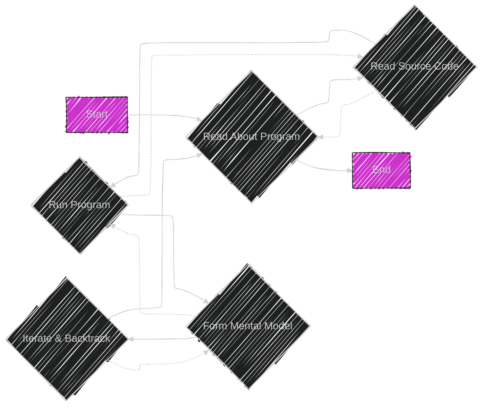
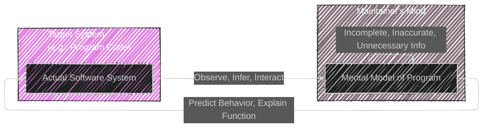
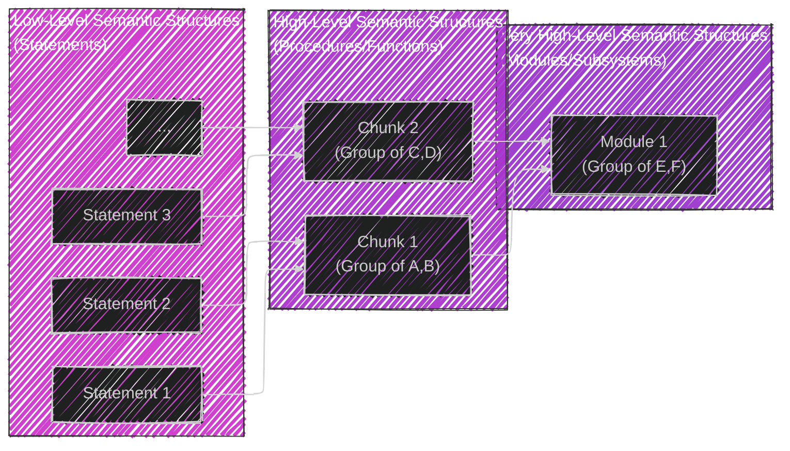
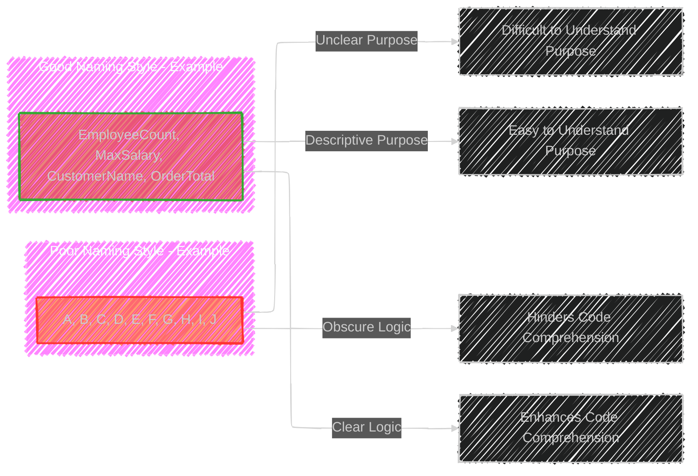

----

# Chapter 6 - Program Understanding

The diagrams below provide a comprehensive visual representation of Chapter 6, "Program Understanding", breaking down its complex concepts into digestible and structured formats using Mermaid syntax.


---

# Diagram 1 - Program Understanding - Main Mindmap

```mermaid
---
config:
  layout: elk
  look: handDrawn
  theme: dark
---
mindmap
  root((Chapter 6: Program Understanding))
    node(Introduction)
      label(Central role in maintenance)
      label(Precursor to change)
      label(High cost of poor understanding)
    node(Definitions)
      label(Key Terminology)
        label(Abstraction Types)
        label(Cognitive Terms)
    node(Aims of Program Comprehension)
      label(Understanding Key Aspects)
        label(Problem Domain)
        label(Execution Effect)
        label(Cause-Effect Relation)
        label(Product-Environment Relation)
        label(Decision-Support Features)
    node(Maintainer's Information Needs)
      label(Different Roles, Different Needs)
        label(Managers - Decision Support)
        label(Analysts - Global View, Impact)
        label(Designers - Architecture, Low-Level Design)
        label(Programmers - Execution, Cause-Effect, Product-Env)
    node(Comprehension Process Models)
      label(Abstract Representation of Process)
      label(Reading, Source Code, Running)
    node(Mental Models)
      label(Internal Representation)
      label(Target System Representation)
      label(Cognitive Structure & Process)
    node(Program Comprehension Strategies)
      label(Approaches to Understanding)
        node(Top-Down Model)
          label(Mapping: Programming to Problem Domain)
          label(Hypothesis-Driven)
          label(Knowledge Domains)
          label(Beacons)
        node(Bottom-Up Model)
          label(Pattern Recognition)
          label(Chunking)
          label(Semantic Structures)
        node(Opportunistic Model)
          label(Combined Approach)
          label(Knowledge Base Driven)
          label(Assimilation Process)
    node(Reading Techniques)
      label(Structured Reading Guides)
      label(Goal-Oriented Reading)
      label(Improved Efficiency)
    node(Factors Affecting Understanding)
      label(Influences on Comprehension)
        node(Expertise)
          label(Domain & Language)
          label(Experience-Based)
        node(Implementation Issues)
          label(Naming Style - Clarity)
          label(Comments - Quality Info)
          label(Decomposition - Modularity)
        node(Documentation)
          label(Quality & Up-to-date)
          label(System & User Docs)
        node(Organisation & Presentation)
          label(Layout & Structure)
          label(Visual Cues)
        node(Support Tools)
          label(Automated Assistance)
          label(e.g., Slicers, Analysers)
        node(Evolving Requirements)
          label(Dynamic Nature)
          label(Impact of Change)
    node(Implications of Theories & Studies)
      label(Practical Applications of Research)
      label(Knowledge Acquisition & Performance)
      label(Education & Training)
      label(Design Principles)
      label(Guidelines & Recommendations)
    node(Summary)
      label(Key Takeaways)
      label(Understanding is Central)
      label(Factors Influencing Understanding)
      label(Link to Next Chapters)

```


This mindmap acts as a central index for Chapter 6. It outlines all the major sections and sub-topics within the chapter, providing a hierarchical overview of "Program Understanding".

---

# Diagram 2 - Aims of Program Comprehension

```mermaid
---
config:
  layout: elk
  look: handDrawn
  theme: dark
---
mindmap
  root((Aims of Program Comprehension))
    node(Problem Domain)
      label(Understand Application Area)
      label(Algorithm Choice)
      label(Methodology Selection)
      label(Resource Estimation)
      label(Personnel Selection)
      label(Information Sources)
        label(Documentation)
        label(Users)
        label(Source Code)
    node(Execution Effect)
      label(Program Behavior)
      label(Input -> Output)
      label(Individual Units & System Level)
      label(Verification of Changes)
      label(Data Flow)
      label(Control Flow)
      label(Algorithmic Patterns)
    node(Cause-Effect Relation)
      label(Component Interaction)
      label(Change Scope Prediction)
      label(Ripple Effect Analysis)
      label(Data Flow Tracing)
      label(Control Flow Tracing)
      label(Bug Source Identification)
    node(Product-Environment Relation)
      label(System in Context)
      label(Environmental Impact)
      label(External Influences)
      label(Predicting Environmental Changes)
      label(Understanding System Evolution)
    node(Decision-Support Features)
      label(Metrics for Decision Making)
      label(Complexity Metrics)
        label(McCabe's)
      label(Maintainability Metrics)
        label(Gilb's)
      label(Technical Decisions)
      label(Management Decisions)
      label(Reverse Engineering Support)

```

**Diagram 2: Aims of Program Comprehension - Detailed Mindmap**

This mindmap expands specifically on the "Aims of Program Comprehension" as discussed in Chapter 6. It details each aim, such as Problem Domain, Execution Effect, Cause-Effect Relation, etc. including their sub-points and importance.

---

# Diagram 3 - Maintainer's Information Needs - Detailed Mindmap

```mermaid
---
config:
  layout: elk
  look: handDrawn
  theme: dark
---
mindmap
  root((Maintainer's Information Needs))
    node(Managers)
      label(Decision-Support Knowledge)
      label(High-Level Understanding)
      label(Cost Estimation)
      label(Resource Allocation)
      label(No Code-Level Detail)
      label(e.g., System Size Metrics)
    node(Analysts)
      label(Global System View)
      label(Problem Domain Expertise)
      label(Functional & Non-Functional Requirements)
      label(System-Environment Interaction)
      label(Impact of Changes on Performance)
      label(Physical Models Useful)
        label(Context Diagrams)
    node(Designers)
      label(Architectural & Detailed Design)
      label(Enhancement Accommodation)
      label(Ripple Effect Prediction)
      label(Effort & Skill Estimation)
      label(Design Notations Useful)
        label(DFDs)
        label(Control Flow)
        label(Structure Charts)
    node(Programmers)
      label(Execution Effect - All Levels)
      label(Cause-Effect Knowledge)
      label(Product-Environment Relation)
      label(Low-Level Details)
        label(Control Flow)
        label(Data Flow)
        label(Algorithms)
      label(Tool Support)
        label(Static Analysis)
        label(Slicers)

```

**Diagram 3: Maintainer's Information Needs - Detailed Mindmap**

This mindmap elaborates on "Maintainer's Information Needs" from Chapter 6, differentiating the specific informational requirements for Managers, Analysts, Designers, and Programmers within a maintenance context.

---

# Diagram 4 - Comprehension Process Model




**Diagram 4: Comprehension Process Model - Flowchart**

This flowchart represents the "Comprehension Process Model" described in Chapter 6. It illustrates the steps of reading about the program, reading source code, and running the program, emphasizing the iterative and backtracking nature of the comprehension process.

---

# Diagram 5 - Program Comprehension Strategies

```mermaid
---
config:
  layout: elk
  look: handDrawn
  theme: dark
---
mindmap
  root((Program Comprehension Strategies))
    node(Top-Down Model)
      label(Mapping Programming to Problem Domain)
      label(Hypothesis Driven)
      label(Start with High-Level Overview)
      label(Refine Hypotheses)
      label(Knowledge Domains - Problem & Programming)
      label(Beacons - Clues & Indicators)
      label(Strength - High-Level Understanding)
      label(Weakness - Detail Acquisition)
    node(Bottom-Up Model)
      label(Pattern Recognition)
      label(Chunking of Code)
      label(Iterative Grouping)
      label(Low-Level to High-Level)
      label(Semantic Structures)
      label(Strength - Detail Focus)
      label(Weakness - Big Picture, Context Loss)
    node(Opportunistic Model)
      label(Combined Approach)
      label(Flexible Strategy)
      label(Context-Dependent)
      label(Knowledge Base Driven)
      label(Assimilation Process)
      label(Balance of Top-Down & Bottom-Up)
      label(Strength - Adaptability)
      label(Weakness - Complexity, Less Structured)

```

**Diagram 5: Program Comprehension Strategies - Detailed Mindmap**

This mindmap further details the "Program Comprehension Strategies": Top-Down, Bottom-Up, and Opportunistic Models. For each strategy, it outlines the key characteristics, strengths, and weaknesses, offering a comparative view.

---


Below are additional diagrams and tables should provide a much more detailed visual understanding of all the core concepts and sub-topics within Chapter 6 of the textbook.


---


# Diagram: Mental Models




**Diagram: Mental Models - Diagram**

This diagram visualizes the concept of "Mental Models" in Chapter 6. It shows the relationship between the "Target System" (the actual program code) and the "Mental Model" formed in the maintainer's mind through observation, inference, and interaction. The dashed arrow indicates that the mental model can be imperfect.

---

# Table 1: Examples of Beacons

```mermaid
---
config:
    themeVariables:
      darkMode: true
---
table Diagram
    title Chapter 6: Examples of Beacons
    header Beacon Type | Example | Aid to Comprehension
    row Internal Beacons | Prologue Comments (Variable Dictionaries) | High-level Overview, Data Dictionary
    row Internal Beacons | Identifier Names (Meaningful Names) | Clues to Functionality, Purpose
    row Internal Beacons | Declarations/Data Divisions (Data Structures) | Data Organization Understanding
    row Internal Beacons | Interline Comments (Explanations) | Low-level Detail, Code Logic
    row Internal Beacons | Indentation/Pretty-Printing (Code Layout) | Structural and Logical Flow
    row Internal Beacons | Subroutine/Module Structure (Modular Design) | System Decomposition, Hierarchy
    row Internal Beacons | I/O Formats/Headers (Data Flow) | Input/Output Behavior, Data Handling
    row External Beacons | User Manuals | System Functionality from User Perspective
    row External Beacons | Program Logic Manuals | Design Rationale, System Architecture
    row External Beacons | Flowcharts | Visual Representation of Control Flow
    row External Beacons | Cross-Reference Listings | Variable Usage, Dependencies
    row External Beacons | Algorithm Descriptions | Algorithmic Approach and Logic
```


This table provides examples of "Beacons" from Chapter 6, categorized as Internal and External Beacons. It lists each beacon type, gives a concrete example, and explains how that beacon aids program comprehension.

---

# Diagram: Chunking in Bottom-Up Comprehension




**Diagram: Chunking in Bottom-Up Comprehension**

This layered diagram visually demonstrates the "Chunking" process in Bottom-Up Comprehension from Chapter 6. It shows how low-level semantic structures (statements) are grouped into high-level chunks (procedures/functions), and then into even higher-order chunks (modules/subsystems), building comprehension from the ground up.

---

# Table 2: Reading Techniques

```mermaid
---
config:
    themeVariables:
      darkMode: true
---
table Diagram
    title Chapter 6: Reading Techniques
    header Technique | Focus | Goal | Key Feature | Potential Drawback
    row General Reading | Broad overview | Initial Familiarization | Wide coverage | Less Depth 
    row Code Reading | Source code detail | Low-Level Understanding | Deep dive into logic | Time Consuming
    row Execution Reading | Dynamic Behavior | System in action | Runtime analysis | Limited Scope of Test Cases
    row Goal-Oriented Reading | Specific task | Targeted Comprehension | Efficiency for task | Narrow Focus, Missed Context
    row Structured Reading | Defined process | Systematic Analysis | Predictable Approach | Rigidity, Overhead
```


This table compares and contrasts different "Reading Techniques" from Chapter 6, including General Reading, Code Reading, Execution Reading, Goal-Oriented Reading and Structured Reading. It highlights the focus, goal, key features, and potential drawbacks of each technique.

---

# Diagram 6: Factors - Implementation Issues (Naming Style - Good vs. Bad Examples)




This diagram illustrates the impact of "Naming Style" under Implementation Issues. It contrasts "Bad" vs. "Good" naming examples, and visually shows how meaningful identifiers (Good Naming) lead to clearer purpose and enhanced code comprehension compared to obscure names (Bad Naming).

---

# Diagram 7: Factors - Support Tools

```mermaid
---
config:
    layout: elk
    look: handDrawn
    theme: dark
---
graph TD
    %% Program Slicer
    PS_In[Source Code];
    PS[Slicer Tool];
    PS_Out["Relevant Code Sections<br>(Slice)"];

    %% StaticAnalyser
    SA_In[Source Code];
    SA[Static Analyser Tool];
    SA_Out["Code Summaries, Cross-References"];

    %% Dynamic Analyser
    DA_In[Running Program];
    DA[Dynamic Analyser Tool];
    DA_Out["Execution Traces, Behavior Analysis"];


    %% Cross Referencer
    CR_In[Source Code];
    CR[Cross-Referencer Tool];
    CR_Out[Identifier Usage Index];

    %% Dependency Analyser
    DepA_In[Source Code];
    DepA[Dependency Analyser Tool];
    DepA_Out["Dependency Graphs, Relationship Analysis"];

    %% Transformation Tool
    TT_In[Code Representation A];
    TT[Transformation Tool];
    TT_Out["Code Representation B (e.g., Visual)"];


    subgraph Program_Slicer[Program Slicer]
    style Program_Slicer fill:#a3f9,stroke:#5a5,stroke-width:1px
        PS_In --> PS --> PS_Out
    end

    subgraph Static_Analyser[Static Analyser]
    style Static_Analyser fill:#a3a9,stroke:#5a5,stroke-width:1px
        SA_In --> SA --> SA_Out
    end

    subgraph Dynamic_Analyser[Dynamic Analyser]
    style Dynamic_Analyser fill:#a359,stroke:#5a5,stroke-width:1px
        DA_In --> DA --> DA_Out
    end

    subgraph Cross_Referencer[Cross-Referencer]
    style Cross_Referencer fill:#f3a9,stroke:#5a5,stroke-width:1px
        CR_In --> CR --> CR_Out
    end

    subgraph Dependency_Analyser[Dependency Analyser]
    style Dependency_Analyser fill:#a3f9,stroke:#5a5,stroke-width:1px
        DepA_In --> DepA --> DepA_Out
    end

    subgraph Transformation_Tool[Transformation Tool]
    style Transformation_Tool fill:#a3f9,stroke:#5a5,stroke-width:1px
        TT_In --> TT --> TT_Out
    end
    
```




This diagram set visualizes different "Support Tools" discussed in Chapter 6.  For each tool (Program Slicer, Static Analyzer, Dynamic Analyzer, Cross-Referencer and Transformation Tool), it illustrates its input (e.g., Source Code, Running Program), the tool itself as a processing block, and the output (e.g., Relevant Code Sections, Execution Traces), clarifying their individual functions in aiding program comprehension.


---
