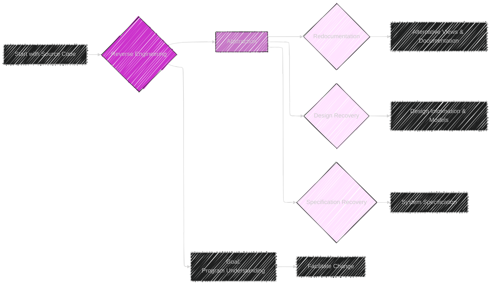
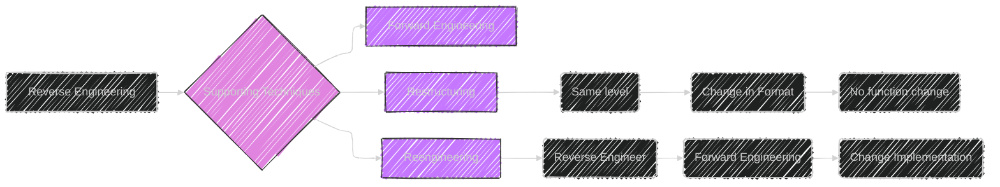

----

# Chapter 7: Reverse Engineering


## Diagram 1: Overview - Mindmap

```mermaid
---
config:
  layout: elk
  look: handDrawn
  theme: dark
---
mindmap
  root(("Chapter 7: <br>Reverse Engineering"))
    node(Introduction)
      label(Focus on Program Understanding)
      label(Reverse Engineering for Change Facilitation)
      label(Reverse Engineering vs. Change Implementation)
    node(Definitions)
      label(Key Terms Defined)
        label(Reverse Engineering)
        label(Forward Engineering)
        label(Reengineering)
        label(Restructuring)
        label(Abstraction)
    node(Abstraction)
      label(Core Concept)
      label(Types of Abstraction)
        node(Function Abstraction)
          label(Eliciting Functions)
          label(Focus on 'What' not 'How')
        node(Data Abstraction)
          label(Eliciting Data Objects)
          label(Focus on Data, not implementation)
          label(Abstract Data Types)
        node(Process Abstraction)
          label(Eliciting Operation Order)
          label("Concurrent and Distributed Processes")
    node(Purpose and Objectives)
      label("Goal: <br>Facilitate Change")
      label(Objectives List)
        label("Recover Lost Information")
        label("Platform Migration")
        label("Improve Documentation")
        label("Provide Alternative Views")
        label("Extract Reusable Components")
        label("Cope with Complexity")
        label("Detect Side Effects")
        label("Reduce Maintenance Effort")
    node(Levels of Reverse Engineering)
      label(Abstraction Levels)
      node(Redocumentation)
        label(Same Abstraction Level)
        label(Alternative Representations)
        label(Enhance Understanding)
      node(Design Recovery)
        label(Higher Abstraction Level)
        label(Recover Design Info)
        label(Not Necessarily Original Design)
      node(Specification Recovery)
        label(Highest Abstraction Level)
        label(Recover System Specification)
        label(Paradigm Shift Context)
    node(Supporting Techniques)
      label(Techniques for Change)
      node(Forward Engineering)
        label(Traditional Development)
        label(Requirements to Implementation)
      node(Restructuring)
        label(Same Abstraction Level)
        label(Transformation to Improve Structure)
        label(No Functionality Change)
      node(Reengineering)
        label(Reverse Engineering + Forward Engineering)
        label(Analysis & Alteration Process)
    node(Benefits)
      label(Advantages of Reverse Engineering)
      node(Maintenance Benefits)
        label(Enhanced Understanding)
        label(Error Identification)
        label(Ripple Effect Prediction)
      node(Software Reuse Benefits)
        label(Component Extraction)
        label(Reusable Assets)
    node("Case Study: <br>US Dept of Defense")
      label(Real-world Application)
      label(Inventory System Example)
      label(Data Requirement Focus)
      label(Lessons Learned)
    node(Current Problems)
      label(Challenges and Limitations)
      label(Automation Limits)
      label(Naming Problem)
    node(Summary)
      label(Key Takeaways)
      label(Recap of Chapter Concepts)

```


This mindmap provides a hierarchical overview of Chapter 7, outlining all the sections and sub-sections to give a structured representation of the chapter's content.

---

## Table 1: Levels of Reverse Engineering

```mermaid
---
config:
    themeVariables:
      darkMode: true
---
table Diagram
    title Chapter 7: Levels of Reverse Engineering
    header Level | Abstraction Level | Objective | Output
    row Redocumentation | Same | Enhance Understanding, Create Alternative Views  | Semantically Equivalent Representation (e.g., Diagrams)
    row Design Recovery | Higher (Design) | Recover Design Information | Design Documents, Architectural Views
    row Specification Recovery | Highest (Specification) | Recover System Specification  | Formal Specification, Abstract Models
```


This table summarizes and compares the three levels of reverse engineering discussed in Chapter 7: Redocumentation, Design Recovery, and Specification Recovery. It compares them based on Abstraction Level, Objective, and Output for quick understanding.

---

## Diagram 2: Reverse Engineering Process



This flowchart illustrates the Reverse Engineering process as described in Chapter 7, starting from Source Code and leading to different levels of abstraction: Redocumentation, Design Recovery, and Specification Recovery. It shows how abstraction facilitates program understanding and ultimately change.

---

## Table 2: Benefits of Reverse Engineering

```mermaid
---
config:
    themeVariables:
      darkMode: true
---
table Diagram
    title Chapter 7: Benefits of Reverse Engineering
    header Benefit Area | Specific Benefit | Description
    row Maintenance | Enhanced Understanding | Easier Error Identification and Correction, Ripple Effect Analysis
    row Maintenance | Facilitated Change Implementation | Supports Adaptive, Perfective, and Preventive Maintenance
    row Maintenance | Improved Documentation | Provides Up-to-date or Alternative Documentation
    row Reuse | Component Extraction | Identifies and Extracts Reusable Components
    row Quality Improvement | Enhanced System Quality | Contributes to more Reliable and Maintainable Systems
    row Cost Reduction | Reduced Maintenance Effort | Decreases Time and Resources Needed for Changes
```

This table outlines the Benefits of Reverse Engineering categorized into Maintenance Benefits, Reuse Benefits and overall Quality and Cost reduction. Each benefit is further described for clarity and impact assessment.

---


Here are the additional diagrams for Chapter 7


---

## Diagram 3: Abstraction Types


This mindmap elaborates on the three abstraction types (Function, Data, and Process) in Chapter 7, providing more detail on each type including defining characteristics and examples.

---

## Diagram 4: Levels of Reverse Engineering


A flowchart that visually details the steps of determining the levels of reverse engineering, showing how source code is transformed from one level to another (Redocumentation, Design Recovery and Specification Recovery)

---

## Diagram 5: Supporting Techniques




This diagram visualizes the Supporting Techniques discussed in chapter 7, using another flowchart to show the relationship between Reverse Engineering, Forward Engineering, Restructuring and Reengineering, including sub-steps taken during Restructuring and Reengineering.

---

## Diagram 6: Case Study (US DoD)

```mermaid
---
config:
  layout: elk
  look: handDrawn
  theme: dark
---
mindmap
    root(("Chapter 7: <br>Case Study - US Department of Defense"))
      node(The Context)
        label(Heterogeneous non-combat info systems)
        label("1700+ data centers and <br>1.4 Billion LOC")
        label("High maintenance costs <br>($9B/year)")
        label("Lack of standardized data")
      node(Objectives)
        label("Integrate different systems")
          label("Focus on data requirements")
      node(Approach)
        label("Reverse engineering data requirements")
        node(Top-down Phase)
          label(High level 'as-is' models)
            label("User screens, reports, policy")
              label("Draft business and <br> data models")

        node(Bottom-up Phase)
          label("Analysis using tools")
            label("Data Dependency Analysis")
            label("Software, data, files ")
              label("Validate and <br> Resolve Inconsistencies")
      node(Outcomes)
        label("Logical data Models")
        label("Data elements")
        label("Model decomposition hierarchies")
        label("Traceability matrix")
        label("Reuse requirements")
        label("Data Migration Plans")
        label("Integrated database")
      node(Lessons Learned)
        label("Management commitment essential")
        label("Human analysis with tool support")
        label("Cost estimation was difficult")
        label("Single tool not sufficient")
        label("Focus on data, not just code")
      label(Conclusion)
      
```


This mindmap details the Case Study within Chapter 7, illustrating the context, objectives, approach (divided into top-down and bottom-up phases), outcomes, and key lessons learned from the DoD's legacy systems reverse engineering project.

---

## Table 3: Conditions for Reverse Engineering

```mermaid
---
config:
    themeVariables:
      darkMode: true
---
table Diagram
    title Chapter 7: Conditions for Reverse Engineering
    header Category | Indicator | Description
    row Product / Environment | Missing or incomplete design/specification | Lack of clear design or requirements documentation
    row Product / Environment | Out-of-date / incorrect / missing documentation | Inaccurate or absent system documentation
    row Product / Environment | Need to translate programs into a different programming language | Software migration to new environments/languages
        row Product / Environment |    Increased Program Complexity | Difficult to understand and modify
 row Product / Environment | Poorly structured source code |  spaghetti code or code with irregular constructs
    row Commercial |  Need to make compatible products | Products needing compatibility with other systems
    row Commercial | Need to migrate between different platforms |  Software relocation due to compatibility issues
    row Maintenance Process | Static or increasing bug backlog | Rising number of reported faults
    row Maintenance Process |  Decreasing personnel productivity | Drop in workforce efficiency for system changes
    row Maintenance Process |  Excessive corrective change |  Frequent bug-fixing and emergency modifications
       row Commercial |    Need to extend economic life of system | System preservation is of prime importance
         row Commercial |  Need to create new or similar products | Competitive product development strategies

```


This table summarizes the various conditions that would motivate the application of Reverse Engineering techniques, categorized into Product/Environment, Maintenance Process, and Commercial conditions, respectively.


----
