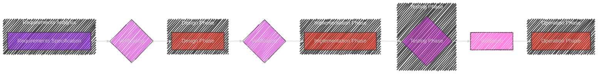

----

# Chapter 9 - Testing

Here are the diagrams and illustrations in Mermaid syntax to cover all the key concepts:

---

# Diagram 1: Testing - Mindmap Overview

```mermaid
---
config:
  layout: elk
  look: handDrawn
  theme: dark
---
mindmap
  root((Chapter 9: Testing))
    node(Introduction)
      label(Define Testing)
      label(Purpose - Error Detection)
      label(Analogy - Imperfect Nature)
    node(Definitions)
      label(Proof)
      label(Test)
    node(Why Test Software)
      label(Cannot Prove Correctness)
      label(Find Errors - Primary Goal)
      label(Limitations of Testing)
      label(Importance of Testing)
    node(What is a Software Tester's Job)
      label(More than Finding Bugs)
      label(Design Effective Tests)
      label(Prioritize & Categorize Errors)
      label(Ensure Fixes)
      label(Value Driven - ROI)
    node(What to Test and How)
      label(Vast Test Case Possibilities)
      label(Constraints & Practicality)
      label(Key Aspects of Test Data)
        label(Valid & Invalid Inputs)
        label(Data Classes & Boundaries)
        label(Likely Error Locations)
        label(Combinations)
        label(Real-World Scenarios)
      label(When to Stop Testing - Risk-Based)
    node(Categorizing Tests)
      label(Testing Code - Focus)
      label(Categorization by Code Type)
        node(Black Box Testing)
          label(Specification-Based)
          label(External View)
        node(White Box Testing)
          label(Code-Based)
          label(Internal View)
        node(Structured Testing)
          label(Maximize Error Detection)
          label(Minimize Redundancy)
        node(Integration Testing)
          label(Component Interaction Focus)
          label(Use of Stubs)
        node(Regression Testing)
          label(Ensure Fix of Bugs)
          label(Prevent New Bugs)
          label(Maintain Test Sets)
    node(Verification and Validation)
      label(Verification - Against Specification)
      label(Validation - External Certification)
      label(Importance of Documentation)
      label(Goal - Reliability, Performance, Quality)
    node(Test Plans)
      label(Purpose - Guide & Product)
      label(IEEE Standard Definition)
      label(Key Elements of Test Plans)
        label(Scope)
        label(Approach)
        label(Resources)
        label(Schedule)
        label(Test Items)
        label(Features to Test)
        label(Testing Tasks)
        label(Responsibilities)
        label(Risk Planning)
      label(Points to Note in Test Planning)
        label(One Error at a Time)
        label(Test Unlikely Scenarios)
        label(Independent Testers)
        label(Expected Outcomes)
    node(Case Study - Therac-25)
      label(Real-World Example of Testing Failures)
      label(Consequences of Inadequate Testing)
      label(Lessons Learned)
    node(Summary)
      label(Key Takeaways from Chapter)

```


This mindmap provides a hierarchical overview of Chapter 9, outlining all the main sections and sub-topics within "Testing". It serves as a table of contents in diagram form, making it easy to see the chapter's structure.

---

# Diagram 2: Categorizing Tests


This flowchart focuses on the different categories of tests discussed in Chapter 9.  `Testing Code` is the main category, broken down into Black Box, White Box, Structured, Integration and Regression Testing. For each test type, key characteristics are highlighted in subgraphs, providing a clear comparison.

---

# Diagram 3: Test Plan Elements

```mermaid
---
config:
  layout: elk
  look: handDrawn
  theme: dark
---
mindmap
  root((Key Elements of a Test Plan))
    Concept((Test Plan))
    Concept -- Scope : Describes the extent of testing
    Concept -- Approach : Defines methodologies & techniques
    Concept -- Resources : Lists required tools & personnel
    Concept -- Schedule : Outlines timelines & milestones
    Concept -- Test Items : Specifies software components
    Concept -- Features to be Tested :  Functionalities to verify
    Concept -- Testing Tasks : Detailed activities involved
    Concept -- Responsibilities : Assigns tasks to team members
    Concept -- Risk Planning : Contingency for potential issues

%%style Concept fill:#e3fe,stroke:#333,stroke-width:1px
%% style root fill:#f3fe,stroke:#333,stroke-width:1px

```


This mindmap illustrates the Key Elements of a Test Plan as per the textbook, branching out from the central "Test Plan" concept to detail Scope, Approach, Resources, Schedule, Test Items, Features, Testing Tasks, Responsibilities and Risk Planning.  It highlights the structured nature of a comprehensive test plan.

---

# Diagram 4: Why Test Software - Comparison Table

```mermaid
table Diagram
    title Chapter 9 - Why Test Software: Core and Fallible Approach Comparison
    header Attributes | Core Belief | Evidence & Practicality
    row **Goal** | Determine if system works correctly | Primarily, find errors because systems are not perfect
    row **Method** | Strives to verify specifications as true | Identifies deviations from specs and expected behavior
    row **Approach** | Aims for confirmation | Focuses on detecting defects and limitations
    row **Perspective** | Assumes system is near-perfect | Expects and anticipates system errors
    row **Test Focus** | Seeks positive test cases for affirmation | Searches for problematic inputs and edge-cases to expose flaws
    row **Outcome Focus** |  Hopes for 'Pass' results | Aims to get most fix on identified bugs

```


This table captures the core difference between a core (idealized but not practical) belief in what testing does vs the practical, real-world approach. It emphasizes that the primary purpose of software testing should be the detection of defects rather than the affirmation of correctness. It highlights the mindset change required in testing.

---

# Diagram 5: Test Data Creation Process


This flowchart visually depicts the process of creating test data, from initial identification of the test object all the way to recording results. It outlines the different paths for deriving test sets - specification- based tests, white-box tests, and operational tests. This visual helps to understand how to approach designing test cases from multiple angles.

---
# Diagram 6: Verification and Validation using Levels




This diagram outlines the role of Verification and Validation by showing where it is applied at each phase of the software life cycle. Verification is shown to be an internal "check" at requirements, design, and unit/integration/system testing phases, whereas Validation takes place at the end when the finished program is handed off to the users. It emphasizes that V&V are processes that ensure systems are built correctly and fulfill the intended usage.

---

# Diagram 7: Testing Levels and Focus

```mermaid
table Diagram
    title Chapter 9: Testing Levels and Focus
    header Testing Type | Focus | Purpose
    row Black Box Testing | Specifications, Interface  | External Functionality, Valid/Invalid Inputs
    row White Box Testing | Internal Structure, Code Path, Branches | Internal Logic, Coverage,  Code Path
    row Structured Testing | Error Minimization, Path Detection | Designed Test Sets that maximize error detection and minimize redundancy
    row Integration Testing | Module Interfaces, Component Interactions | Interactions among units, data flow integrity
    row Regression Testing | Change Impact, Prevent Regressions | Ensure Fixes, Prevent New Bugs, Maintain Test Sets

```


This table provides a quick comparison of the different testing types, highlighting their focus area and primary purpose of each type of testing discussed.


----
