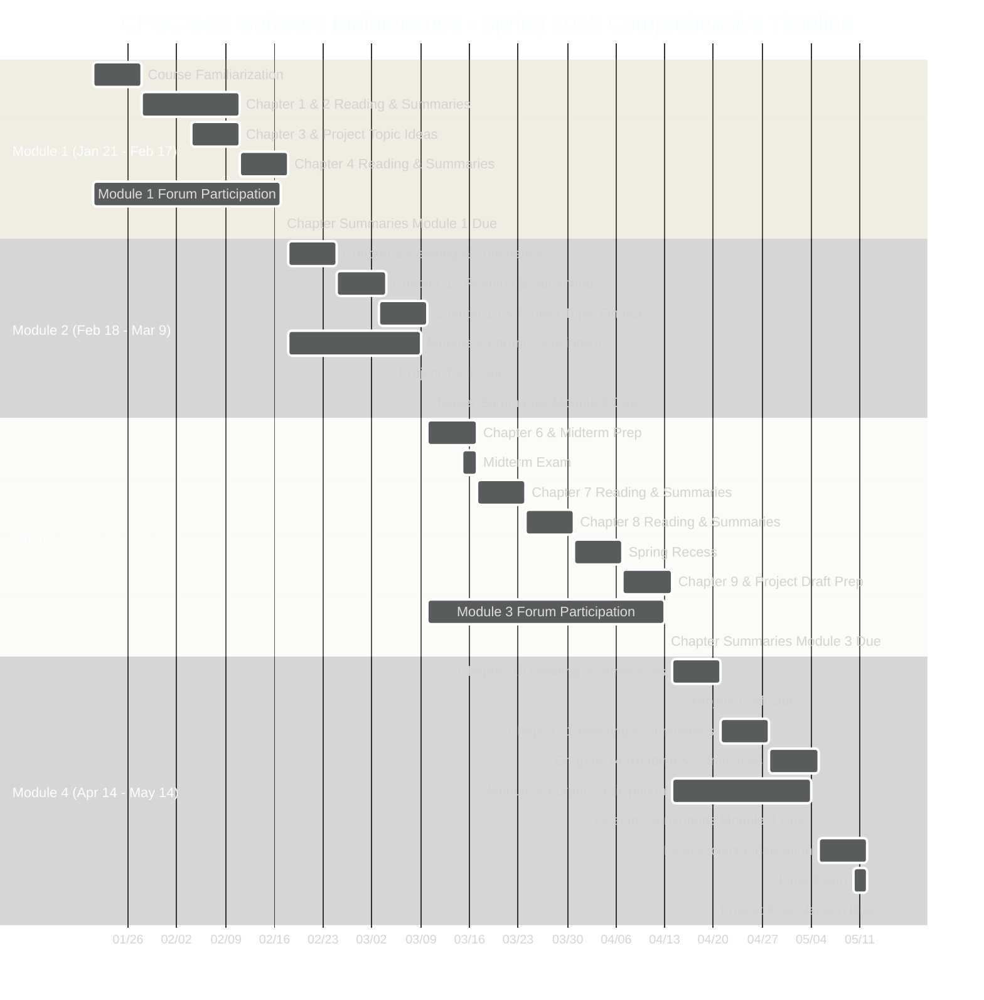

# Comprehensive Course Information for CPSC 543 - Software Maintenance (Spring 2025)

## Course Overview

This online course, CPSC 543, focuses on software maintenance, crucial for understanding how to build and maintain large-scale software systems. You will learn the theoretical foundations and practical applications, including maintenance metrics. The course emphasizes both preparing software for maintenance and managing maintenance activities.

## Instructor Information

*   **Instructor:** Dr. Song-James Choi, Ph.D.
*   **Office:** CS427
*   **Phone:** (657) 278-7257
*   **Email:** [jchoi@fullerton.edu](mailto:jchoi@fullerton.edu)
*   **Office Hours:** Tuesdays and Thursdays, 5:30 PM - 6:30 PM via Zoom ([https://fullerton.zoom.us/j/85605249068](https://fullerton.zoom.us/j/85605249068))

## Prerequisites

*   CPSC 362 or equivalent work experience.

## Required and Recommended Textbooks

*   **Required:** *Software Maintenance* by Grubb and Takang (2003)
*   **Recommended:** *Practical Software Maintenance* by Pigoski (1997)

## Coursework and Grading (Total 100%)

*   **Term Project (35%)**
    *   Project Topic Due: March 5th (5%)
    *   Project Draft Due: April 16th (5%)
    *   Final Version Due: May 14th (25%)
*   **Midterm Exam (15%)**
    *   Availability Period: March 15th (Saturday, 9 AM) - March 16th (Sunday, 10 PM)
    *   Absolute Deadline: March 16th, 10:00 PM
    *   No make-up exam. In emergencies, contact the instructor ASAP to shift weight to the final exam.
*   **Final Exam (30%)**
    *   Availability Period: May 10th (Saturday, 9 AM) - May 11th (Sunday, 10 PM)
    *   Absolute Deadline: May 11th, 10:00 PM
    *   University policy for missed final exams will be followed.
*   **Class Participation (20%)**
    *   **Chapter Summaries (10%):** 2-3 pages per chapter, covering concepts, applications, and your opinions. Submit per module as a single Word or PDF file.
    *   **Forum Discussions (10%):** Minimum of 2 meaningful posts per chapter (28+ total). Discussions should relate to Part 2 of your chapter summaries. No exam question discussions allowed. Forums close with each module's summary due date.

## Grading Scale

*   A- or higher: 90%+
*   B- or higher: 80-89%
*   C- or higher: 70-79%
*   D- or higher: 60-69%
*   F: 0-59%

## Important Course Policies and Notes

*   **Communication:** Regularly check your email and Canvas (daily or 2-3 times a week).
*   **Late Submissions:** Accepted (except forum posts) with a 20% deduction for the first late day and 1% per additional day. Absolute last submission date is May 14th.
*   **Online Course:** Entirely online, with all materials on Canvas.
*   **Online Activity Tracking:** Your engagement online will be monitored.
*   **Netiquette:** Adhere to the "Core Rules of Netiquette" in the syllabus.
*   **Academic Honesty:** All work must be original. Academic dishonesty will result in an "F".
*   **ADA Accommodations:** Contact Disability Support Services within the first week for accommodations.
*   **Emergency Procedures:** Review emergency guidelines.
*   **Instructor Contact:** Contact Dr. Choi for any course-related issues.

## Weekly Schedule and Tasks

Here’s a detailed breakdown of what you should be doing each week. This combines the chapter readings, deadlines, and project milestones:

### Module 1 (Chapters 1-4)

*   **Week 1 (Jan 21 - Jan 27):**
    *   Task: Familiarize yourself with the course structure on Canvas.
    *   Task: Begin reading Chapter 1 of *Software Maintenance* textbook.
    *   Action: Optional: Check out recommended textbook *Practical Software Maintenance*.
*   **Week 2 (Jan 28 – Feb 3):**
    *   Task: Finish reading Chapter 1 and Chapter 2.
    *   Task: Start drafting chapter summaries for Chapters 1 and 2.
    *   Action: Begin participating in the Module 1 forum discussions.
*   **Week 3 (Feb 4 - Feb 10):**
    *   Task: Read Chapter 3.
    *   Task: Begin thinking about potential project topics and initial ideas.
    *   Task: Continue drafting chapter summaries for Chapters 1-3.
    *   Action: Actively participate in Module 1 forum discussions.
*   **Week 4 (Feb 11 – Feb 17):**
    *   Task: Read Chapter 4.
    *   Task: Finalize chapter summaries for Chapters 1-4.
    *   Task: Participate in Module 1 forum discussions.
    *   **Deadline: Sunday, Feb 17 - Chapter Summaries for Module 1 due (Chapters 1-4). Module 1 forum closes.**

### Module 2 (Chapters 5, 12 & 13)

*   **Week 5 (Feb 18 – Feb 24):**
    *   Task: Read Chapter 5.
    *   Task: Start drafting chapter summary for Chapter 5.
    *   Action: Begin participating in the Module 2 forum discussions.
*   **Week 6 (Feb 25 – Mar 2):**
    *   Task: Read Chapter 12.
    *   Task: Draft chapter summaries for Chapter 5 and Chapter 12.
    *   Action: Continue Module 2 forum discussions actively.
*   **Week 7 (Mar 3 – Mar 9):**
    *   Task: Read Chapter 13.
    *   Task: Finalize chapter summaries for Chapters 5, 12, and 13.
    *   Task: Finalize your project topic choice.
    *   Action: Participate in Module 2 forum discussions.
    *   **Deadline: Wednesday, Mar 5 - Project Topic Due.**
    *   **Deadline: Sunday, Mar 9 - Chapter Summaries for Module 2 due (Chapters 5, 12, 13). Module 2 forum closes.**

### Module 3 (Chapters 6 - 9)

*   **Week 8 (Mar 10 – Mar 16):**
    *   Task: Read Chapter 6.
    *   Task: Begin preparing for the Midterm Exam (Chapters 1-5, 12, 13).
    *   Task: Start drafting chapter summary for Chapter 6.
    *   **Midterm Exam: Saturday, Mar 15 (9 AM) - Sunday, Mar 16 (10 PM). Absolute Deadline: Sunday, Mar 16, 10 PM.**
*   **Week 9 (Mar 17 – Mar 23):**
    *   Task: Read Chapter 7.
    *   Task: Draft chapter summary for Chapter 7.
    *   Action: Rest after the midterm, but stay on track with readings.
*   **Week 10 (Mar 24 – Mar 30):**
    *   Task: Read Chapter 8.
    *   Task: Draft chapter summary for Chapter 8.
    *   Action: Continue working on project planning.
*   **Week of Mar 31 – Apr 6: Spring Recess - No classes or office hours.**
    *   *Enjoy your break!*
*   **Week 11 (Apr 7 – Apr 13):**
    *   Task: Read Chapter 9.
    *   Task: Finalize chapter summaries for Chapters 6-9.
    *   Task: Complete a draft version of your term project.
    *   Action: Participate in Module 3 forum discussions.
    *   **Deadline: Sunday, Apr 13 - Chapter Summaries for Module 3 due (Chapters 6-9). Module 3 forum closes.**

### Module 4 (Chapters 10, 11 & 14 and Project)

*   **Week 12 (Apr 14 – Apr 20):**
    *   Task: Read Chapter 10.
    *   Task: Draft chapter summary for Chapter 10.
    *   Task: Submit Project Draft.
    *   **Deadline: Wednesday, Apr 16 - Project Draft Due.**
*   **Week 13 (Apr 21 – Apr 27):**
    *   Task: Read Chapter 11.
    *   Task: Draft chapter summary for Chapter 11.
    *   Action: Work on project revisions based on feedback.
*   **Week 14 (Apr 28 – May 4):**
    *   Task: Read Chapter 14.
    *   Task: Finalize chapter summaries for Chapters 10, 11, and 14.
    *   Action: Finalize your project.
    *   **Deadline: Sunday, May 4 - Chapter Summaries for Module 4 due (Chapters 10, 11, 14). Module 4 forum closes.**
*   **Week 15 (May 5 – May 11):**
    *   Task: Finalize your term project.
    *   Task: Prepare for the Final Exam (Comprehensive).
    *   **Final Exam: Saturday, May 10 (9 AM) - Sunday, May 11 (10 PM). Absolute Deadline: Sunday, May 11, 10 PM.**
*   **Week 16 (May 12 – May 18):**
    *   **Deadline: Wednesday, May 14 - Project Final Version Due. Absolute Last Day for Late Submissions.**

### Comprehensive Gantt Chart

Here is a detailed Gantt chart for the entire course, summarizing all tasks and deadlines:

